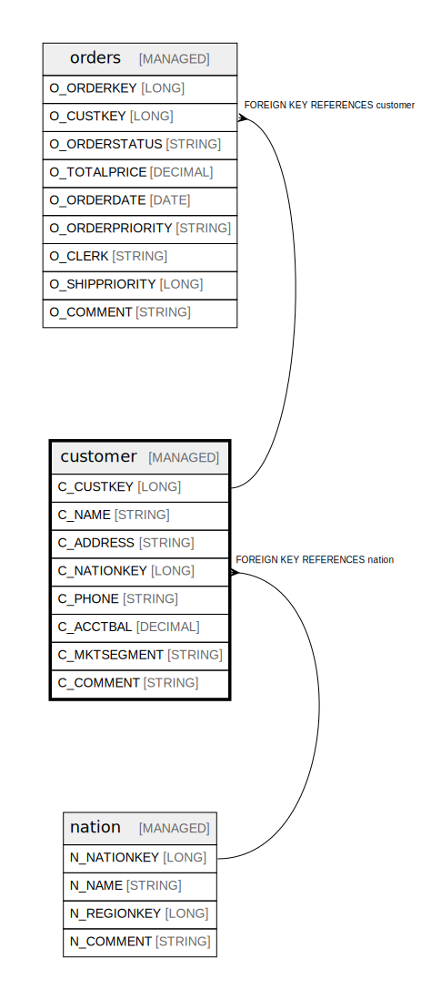

# customer

## Description

Customer information including demographics and account details

## Columns

| Name | Type | Default | Nullable | Children | Parents | Comment |
| ---- | ---- | ------- | -------- | -------- | ------- | ------- |
| C_CUSTKEY | LONG |  | false | [orders](orders.md) |  | Unique identifier for each customer |
| C_NAME | STRING |  | false |  |  | Name of the customer |
| C_ADDRESS | STRING |  | false |  |  | Complete address of the customer |
| C_NATIONKEY | LONG |  | false |  | [nation](nation.md) | Foreign key to the nation where customer is located |
| C_PHONE | STRING |  | false |  |  | Phone number of the customer |
| C_ACCTBAL | DECIMAL |  | false |  |  | Account balance of the customer |
| C_MKTSEGMENT | STRING |  | true |  |  | Market segment classification (e.g. BUILDING, AUTOMOBILE) |
| C_COMMENT | STRING |  | true |  |  | General comments about the customer |

## Constraints

| Name | Type | Definition |
| ---- | ---- | ---------- |
| customer_nationkey_fk | FOREIGN KEY | FOREIGN KEY (C_NATIONKEY) REFERENCES nation(N_NATIONKEY) |
| customer_pk | PRIMARY KEY | PRIMARY KEY (C_CUSTKEY) |

## Relations

---

> Generated by [tbls](https://github.com/k1LoW/tbls)
