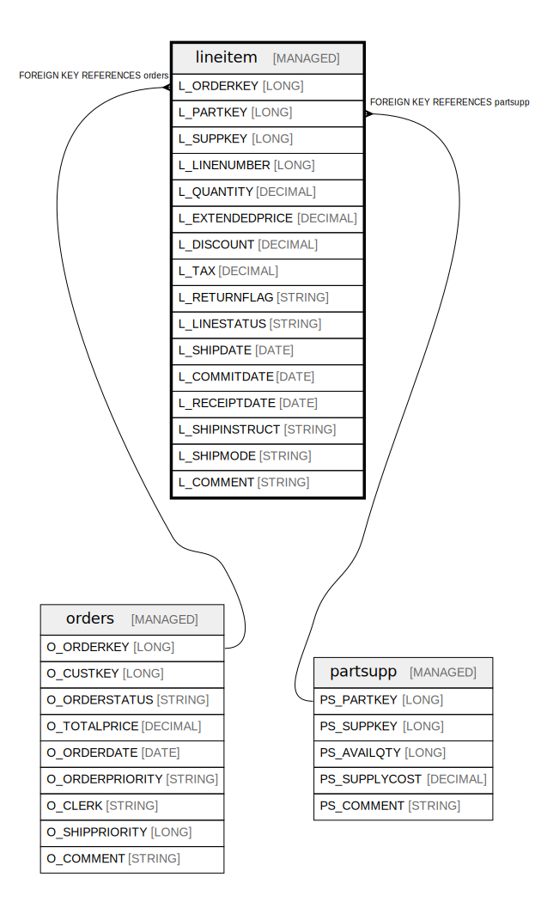

# lineitem

## Description

Individual line items within orders, including pricing, shipping, and part details

## Columns

| Name | Type | Default | Nullable | Children | Parents | Comment |
| ---- | ---- | ------- | -------- | -------- | ------- | ------- |
| L_ORDERKEY | LONG |  | false |  | [orders](orders.md) | Foreign key to the parent order |
| L_PARTKEY | LONG |  | false |  | [partsupp](partsupp.md) | Foreign key to the part being ordered |
| L_SUPPKEY | LONG |  | false |  | [partsupp](partsupp.md) | Foreign key to the supplier of the part |
| L_LINENUMBER | LONG |  | false |  |  | Line number within the order (1, 2, 3, ...) |
| L_QUANTITY | DECIMAL |  | false |  |  | Quantity of the part ordered |
| L_EXTENDEDPRICE | DECIMAL |  | false |  |  | Extended price (quantity * unit price) |
| L_DISCOUNT | DECIMAL |  | false |  |  | Discount percentage applied to this line item |
| L_TAX | DECIMAL |  | false |  |  | Tax percentage applied to this line item |
| L_RETURNFLAG | STRING |  | false |  |  | Return flag (A=Available, N=Not available, R=Returned) |
| L_LINESTATUS | STRING |  | false |  |  | Line status (F=Fulfilled, O=Open) |
| L_SHIPDATE | DATE |  | false |  |  | Date when the line item was shipped |
| L_COMMITDATE | DATE |  | false |  |  | Date when delivery was committed |
| L_RECEIPTDATE | DATE |  | false |  |  | Date when the line item was received |
| L_SHIPINSTRUCT | STRING |  | false |  |  | Shipping instructions for this line item |
| L_SHIPMODE | STRING |  | false |  |  | Mode of shipping (TRUCK, MAIL, SHIP, AIR, etc.) |
| L_COMMENT | STRING |  | false |  |  | General comments about this line item |

## Constraints

| Name | Type | Definition |
| ---- | ---- | ---------- |
| lineitem_orderkey_fk | FOREIGN KEY | FOREIGN KEY (L_ORDERKEY) REFERENCES orders(O_ORDERKEY) |
| lineitem_partsupp_fk | FOREIGN KEY | FOREIGN KEY (L_SUPPKEY, L_PARTKEY) REFERENCES partsupp(PS_SUPPKEY, PS_PARTKEY) |
| lineitem_pk | PRIMARY KEY | PRIMARY KEY (L_LINENUMBER, L_ORDERKEY) |

## Relations

---

> Generated by [tbls](https://github.com/k1LoW/tbls)
