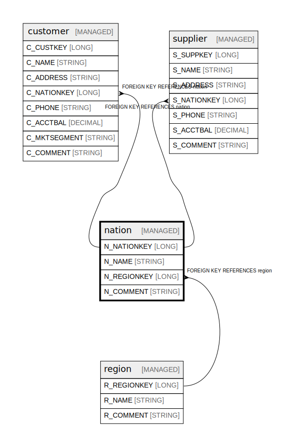

# nation

## Description

Countries/nations with their associated regions

## Columns

| Name | Type | Default | Nullable | Children | Parents | Comment |
| ---- | ---- | ------- | -------- | -------- | ------- | ------- |
| N_NATIONKEY | LONG |  | false | [customer](customer.md) [supplier](supplier.md) |  | Unique identifier for each nation/country |
| N_NAME | STRING |  | false |  |  | Name of the nation/country |
| N_REGIONKEY | LONG |  | false |  | [region](region.md) | Foreign key to the region this nation belongs to |
| N_COMMENT | STRING |  | true |  |  | General comments about the nation |

## Constraints

| Name | Type | Definition |
| ---- | ---- | ---------- |
| nation_pk | PRIMARY KEY | PRIMARY KEY (N_NATIONKEY) |
| nation_regionkey_fk | FOREIGN KEY | FOREIGN KEY (N_REGIONKEY) REFERENCES region(R_REGIONKEY) |

## Relations

---

> Generated by [tbls](https://github.com/k1LoW/tbls)
