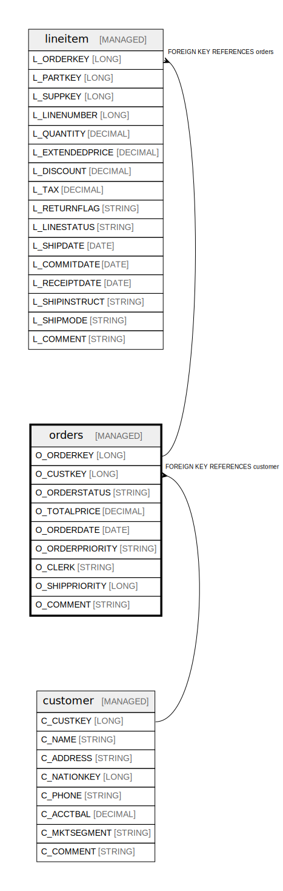

# orders

## Description

Customer orders with status, pricing, and processing information

## Columns

| Name | Type | Default | Nullable | Children | Parents | Comment |
| ---- | ---- | ------- | -------- | -------- | ------- | ------- |
| O_ORDERKEY | LONG |  | false | [lineitem](lineitem.md) |  | Unique identifier for each order |
| O_CUSTKEY | LONG |  | false |  | [customer](customer.md) | Foreign key to the customer who placed the order |
| O_ORDERSTATUS | STRING |  | false |  |  | Status of the order (F=Fulfilled, O=Open, P=Partial) |
| O_TOTALPRICE | DECIMAL |  | false |  |  | Total price of the order including all line items |
| O_ORDERDATE | DATE |  | false |  |  | Date when the order was placed |
| O_ORDERPRIORITY | STRING |  | false |  |  | Priority level assigned to the order |
| O_CLERK | STRING |  | false |  |  | Clerk who processed the order |
| O_SHIPPRIORITY | LONG |  | false |  |  | Shipping priority assigned to the order |
| O_COMMENT | STRING |  | false |  |  | General comments about the order |

## Constraints

| Name | Type | Definition |
| ---- | ---- | ---------- |
| orders_custkey_fk | FOREIGN KEY | FOREIGN KEY (O_CUSTKEY) REFERENCES customer(C_CUSTKEY) |
| orders_pk | PRIMARY KEY | PRIMARY KEY (O_ORDERKEY) |

## Relations

---

> Generated by [tbls](https://github.com/k1LoW/tbls)
