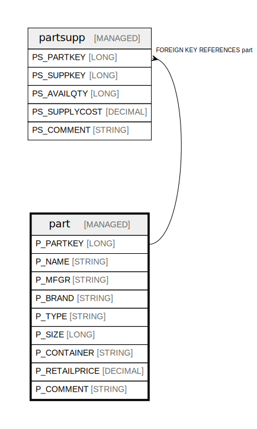

# part

## Description

Parts catalog with manufacturing and pricing information

## Columns

| Name | Type | Default | Nullable | Children | Parents | Comment |
| ---- | ---- | ------- | -------- | -------- | ------- | ------- |
| P_PARTKEY | LONG |  | false | [partsupp](partsupp.md) |  | Unique identifier for each part in the catalog |
| P_NAME | STRING |  | false |  |  | Name of the part |
| P_MFGR | STRING |  | false |  |  | Manufacturer of the part |
| P_BRAND | STRING |  | false |  |  | Brand name of the part |
| P_TYPE | STRING |  | false |  |  | Type/category of the part |
| P_SIZE | LONG |  | false |  |  | Size of the part in standardized units |
| P_CONTAINER | STRING |  | false |  |  | Container type for shipping the part |
| P_RETAILPRICE | DECIMAL |  | false |  |  | Retail price of the part |
| P_COMMENT | STRING |  | true |  |  | General comments about the part |

## Constraints

| Name | Type | Definition |
| ---- | ---- | ---------- |
| part_pk | PRIMARY KEY | PRIMARY KEY (P_PARTKEY) |

## Relations

---

> Generated by [tbls](https://github.com/k1LoW/tbls)
