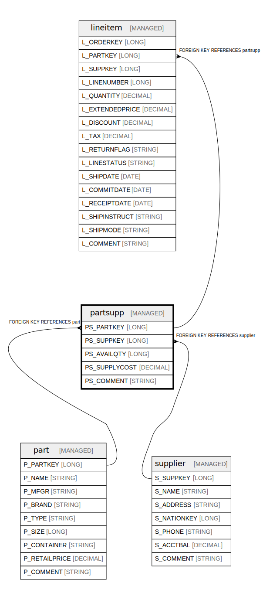

# partsupp

## Description

Association of parts with suppliers including available quantity and cost

## Columns

| Name | Type | Default | Nullable | Children | Parents | Comment |
| ---- | ---- | ------- | -------- | -------- | ------- | ------- |
| PS_PARTKEY | LONG |  | false | [lineitem](lineitem.md) | [part](part.md) | Foreign key to the part being supplied |
| PS_SUPPKEY | LONG |  | false | [lineitem](lineitem.md) | [supplier](supplier.md) | Foreign key to the supplier providing the part |
| PS_AVAILQTY | LONG |  | false |  |  | Available quantity of this part from this supplier |
| PS_SUPPLYCOST | DECIMAL |  | false |  |  | Cost to supply this part from this supplier |
| PS_COMMENT | STRING |  | true |  |  | General comments about this part-supplier relationship |

## Constraints

| Name | Type | Definition |
| ---- | ---- | ---------- |
| partsupp_partkey_fk | FOREIGN KEY | FOREIGN KEY (PS_PARTKEY) REFERENCES part(P_PARTKEY) |
| partsupp_pk | PRIMARY KEY | PRIMARY KEY (PS_SUPPKEY, PS_PARTKEY) |
| partsupp_suppkey_fk | FOREIGN KEY | FOREIGN KEY (PS_SUPPKEY) REFERENCES supplier(S_SUPPKEY) |

## Relations

---

> Generated by [tbls](https://github.com/k1LoW/tbls)
