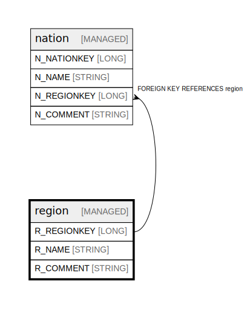

# region

## Description

Geographic regions containing nations

## Columns

| Name | Type | Default | Nullable | Children | Parents | Comment |
| ---- | ---- | ------- | -------- | -------- | ------- | ------- |
| R_REGIONKEY | LONG |  | false | [nation](nation.md) |  | Unique identifier for each geographic region |
| R_NAME | STRING |  | false |  |  | Name of the geographic region (e.g. AMERICA, ASIA) |
| R_COMMENT | STRING |  | true |  |  | General comments about the region |

## Constraints

| Name | Type | Definition |
| ---- | ---- | ---------- |
| region_pk | PRIMARY KEY | PRIMARY KEY (R_REGIONKEY) |

## Relations

---

> Generated by [tbls](https://github.com/k1LoW/tbls)
