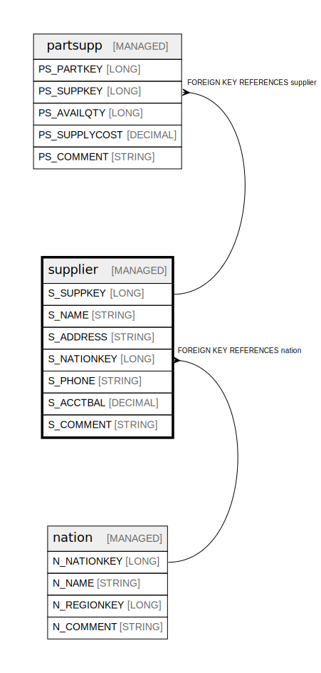

# supplier

## Description

Suppliers with contact and account information

## Columns

| Name | Type | Default | Nullable | Children | Parents | Comment |
| ---- | ---- | ------- | -------- | -------- | ------- | ------- |
| S_SUPPKEY | LONG |  | false | [partsupp](partsupp.md) |  | Unique identifier for each supplier |
| S_NAME | STRING |  | false |  |  | Name of the supplier company |
| S_ADDRESS | STRING |  | false |  |  | Complete address of the supplier |
| S_NATIONKEY | LONG |  | false |  | [nation](nation.md) | Foreign key to the nation where supplier is located |
| S_PHONE | STRING |  | false |  |  | Phone number of the supplier |
| S_ACCTBAL | DECIMAL |  | false |  |  | Account balance with this supplier |
| S_COMMENT | STRING |  | true |  |  | General comments about the supplier |

## Constraints

| Name | Type | Definition |
| ---- | ---- | ---------- |
| supplier_nationkey_fk | FOREIGN KEY | FOREIGN KEY (S_NATIONKEY) REFERENCES nation(N_NATIONKEY) |
| supplier_pk | PRIMARY KEY | PRIMARY KEY (S_SUPPKEY) |

## Relations

---

> Generated by [tbls](https://github.com/k1LoW/tbls)
