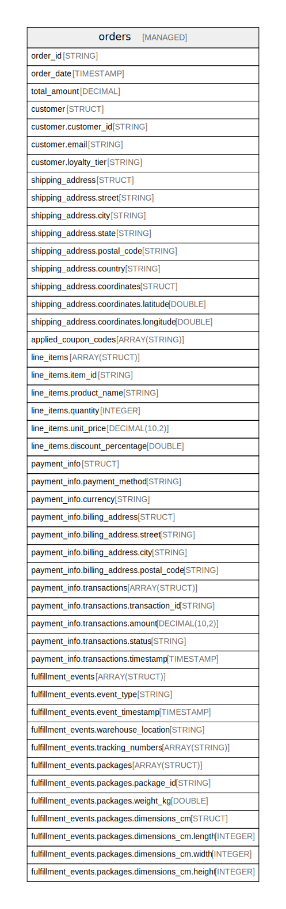

# workspace.nesting_examples

## Tables

| Name | Columns | Comment | Type |
| ---- | ------- | ------- | ---- |
| [orders](orders.md) | 47 | E-commerce orders with complex nested data structures | MANAGED |

## Relations

---

> Generated by [tbls](https://github.com/k1LoW/tbls)
