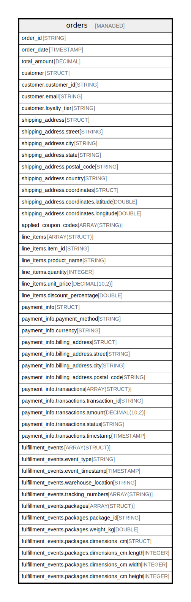

# orders

## Description

E-commerce orders with complex nested data structures

## Columns

| Name | Type | Default | Nullable | Children | Parents | Comment |
| ---- | ---- | ------- | -------- | -------- | ------- | ------- |
| order_id | STRING |  | true |  |  | Unique identifier for each order |
| order_date | TIMESTAMP |  | true |  |  | Date and time when the order was placed |
| total_amount | DECIMAL |  | true |  |  | Total order amount in the base currency |
| customer | STRUCT |  | true |  |  | Customer information as a simple struct |
| customer.customer_id | STRING |  | true |  |  | Unique customer identifier |
| customer.email | STRING |  | true |  |  | Customer email address |
| customer.loyalty_tier | STRING |  | true |  |  | Customer loyalty program tier (Bronze, Silver, Gold, Platinum) |
| shipping_address | STRUCT |  | true |  |  | Shipping address with nested coordinate struct |
| shipping_address.street | STRING |  | true |  |  | Street address |
| shipping_address.city | STRING |  | true |  |  | City name |
| shipping_address.state | STRING |  | true |  |  | State or province |
| shipping_address.postal_code | STRING |  | true |  |  | Postal or ZIP code |
| shipping_address.country | STRING |  | true |  |  | Country name |
| shipping_address.coordinates | STRUCT |  | true |  |  | Geographic coordinates for delivery location |
| shipping_address.coordinates.latitude | DOUBLE |  | true |  |  | Latitude coordinate |
| shipping_address.coordinates.longitude | DOUBLE |  | true |  |  | Longitude coordinate |
| applied_coupon_codes | ARRAY(STRING) |  | true |  |  | List of coupon codes applied to this order |
| line_items | ARRAY(STRUCT) |  | true |  |  | Order line items with product details and pricing |
| line_items.item_id | STRING |  | true |  |  | Unique item identifier |
| line_items.product_name | STRING |  | true |  |  | Name of the product |
| line_items.quantity | INTEGER |  | true |  |  | Number of units ordered |
| line_items.unit_price | DECIMAL(10,2) |  | true |  |  | Price per unit |
| line_items.discount_percentage | DOUBLE |  | true |  |  | Discount percentage applied to this item |
| payment_info | STRUCT |  | true |  |  | Payment information including method, billing, and transaction history |
| payment_info.payment_method | STRING |  | true |  |  | Payment method used (credit card, PayPal, etc.) |
| payment_info.currency | STRING |  | true |  |  | Currency code (USD, EUR, GBP, etc.) |
| payment_info.billing_address | STRUCT |  | true |  |  | Billing address for payment |
| payment_info.billing_address.street | STRING |  | true |  |  | Billing street address |
| payment_info.billing_address.city | STRING |  | true |  |  | Billing city |
| payment_info.billing_address.postal_code | STRING |  | true |  |  | Billing postal code |
| payment_info.transactions | ARRAY(STRUCT) |  | true |  |  | List of payment transactions for this order |
| payment_info.transactions.transaction_id | STRING |  | true |  |  | Unique transaction identifier |
| payment_info.transactions.amount | DECIMAL(10,2) |  | true |  |  | Transaction amount |
| payment_info.transactions.status | STRING |  | true |  |  | Transaction status (pending, completed, failed, refunded) |
| payment_info.transactions.timestamp | TIMESTAMP |  | true |  |  | Transaction timestamp |
| product_metadata | MAP(STRING, STRING) |  | true |  |  | Key-value pairs for custom product attributes and metadata |
| fulfillment_events | ARRAY(STRUCT) |  | true |  |  | Order fulfillment history with packaging and shipping details |
| fulfillment_events.event_type | STRING |  | true |  |  | Type of fulfillment event (picked, packed, shipped, delivered) |
| fulfillment_events.event_timestamp | TIMESTAMP |  | true |  |  | When the event occurred |
| fulfillment_events.warehouse_location | STRING |  | true |  |  | Warehouse or distribution center code |
| fulfillment_events.tracking_numbers | ARRAY(STRING) |  | true |  |  | Shipping carrier tracking numbers |
| fulfillment_events.packages | ARRAY(STRUCT) |  | true |  |  | List of packages in this fulfillment event |
| fulfillment_events.packages.package_id | STRING |  | true |  |  | Unique package identifier |
| fulfillment_events.packages.weight_kg | DOUBLE |  | true |  |  | Package weight in kilograms |
| fulfillment_events.packages.dimensions_cm | STRUCT |  | true |  |  | Package dimensions for shipping calculations |
| fulfillment_events.packages.dimensions_cm.length | INTEGER |  | true |  |  | Package length in centimeters |
| fulfillment_events.packages.dimensions_cm.width | INTEGER |  | true |  |  | Package width in centimeters |
| fulfillment_events.packages.dimensions_cm.height | INTEGER |  | true |  |  | Package height in centimeters |

## Relations

---

> Generated by [tbls](https://github.com/k1LoW/tbls)
