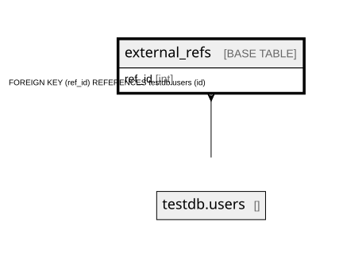

# external_refs

## Description

<details>
<summary><strong>Table Definition</strong></summary>

```sql
CREATE TABLE `external_refs` (
  `ref_id` int NOT NULL,
  KEY `external_refs_fk` (`ref_id`),
  CONSTRAINT `external_refs_fk` FOREIGN KEY (`ref_id`) REFERENCES `testdb`.`users` (`id`)
) ENGINE=InnoDB DEFAULT CHARSET=utf8mb4 COLLATE=utf8mb4_0900_ai_ci
```

</details>

## Columns

| Name | Type | Default | Nullable | Children | Parents | Comment |
| ---- | ---- | ------- | -------- | -------- | ------- | ------- |
| ref_id | int |  | false |  | testdb.users |  |

## Constraints

| Name | Type | Definition |
| ---- | ---- | ---------- |
| external_refs_fk | FOREIGN KEY | FOREIGN KEY (ref_id) REFERENCES testdb.users (id) |

## Indexes

| Name | Definition |
| ---- | ---------- |
| external_refs_fk | KEY external_refs_fk (ref_id) USING BTREE |

## Relations



---

> Generated by [tbls](https://github.com/k1LoW/tbls)
