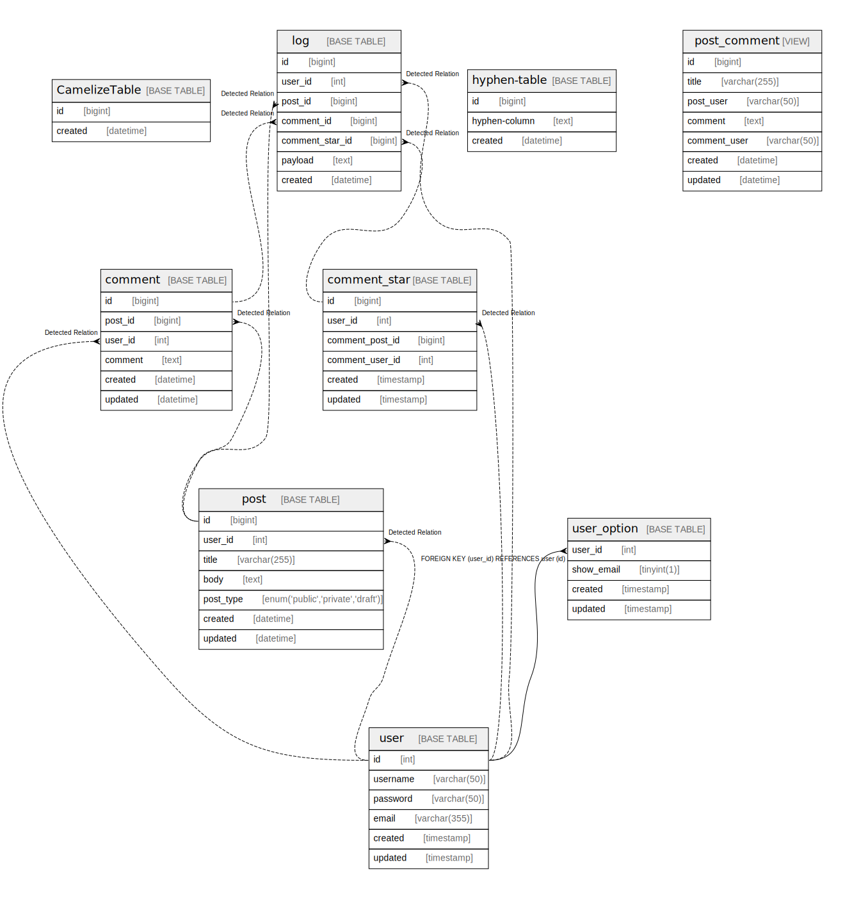

# relations_singular

## Description

Sample database document.

## Labels

`sample` `tbls`

## Tables

| Name | Columns | Comment | Type | Labels |
| ---- | ------- | ------- | ---- | ------ |
| [CamelizeTable](CamelizeTable.md) | 2 |  | BASE TABLE |  |
| [comment](comment.md) | 6 | Comment Multi-line table comment | BASE TABLE |  |
| [comment_star](comment_star.md) | 6 |  | BASE TABLE |  |
| [hyphen-table](hyphen-table.md) | 3 |  | BASE TABLE |  |
| [log](log.md) | 7 | Auditログ | BASE TABLE |  |
| [post](post.md) | 7 | Post table | BASE TABLE | `green` `red` `blue` |
| [post_comment](post_comment.md) | 7 | post and comments View table | VIEW |  |
| [user](user.md) | 6 | User table | BASE TABLE |  |
| [user_option](user_option.md) | 4 | User option table | BASE TABLE |  |

## Subroutines

| Name | ReturnType | Arguments | Type |
| ---- | ------- | ------- | ---- |
| CustomerLevel | varchar | credit decimal | FUNCTION |
| GetAllComments |  |  | PROCEDURE |

## Relations

---

> Generated by [tbls](https://github.com/k1LoW/tbls)
