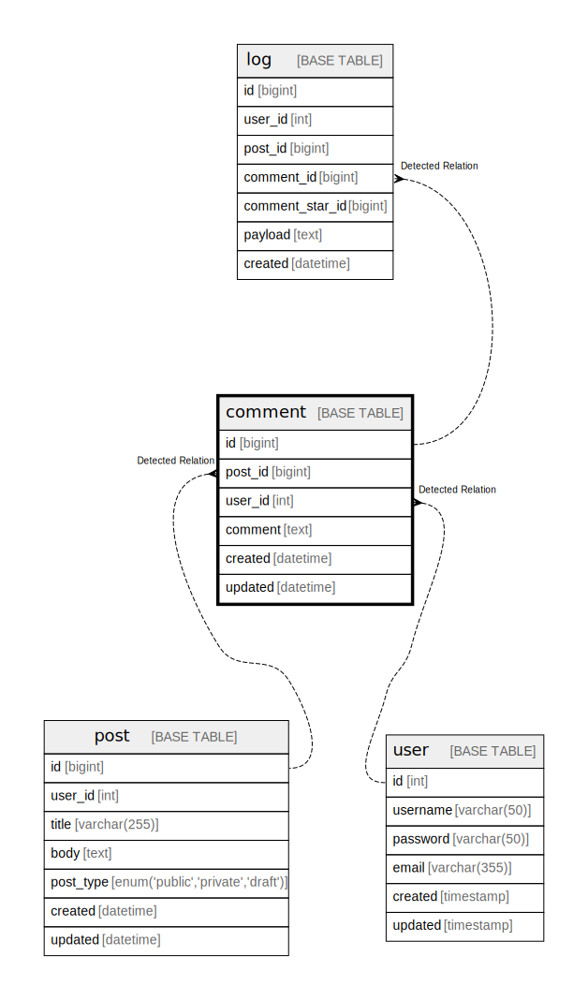

# comment

## Description

Comment  
Multi-line  
table  
comment

<details>
<summary><strong>Table Definition</strong></summary>

```sql
CREATE TABLE `comment` (
  `id` bigint NOT NULL AUTO_INCREMENT,
  `post_id` bigint NOT NULL,
  `user_id` int NOT NULL,
  `comment` text NOT NULL COMMENT 'Comment\nMulti-line\r\ncolumn\rcomment',
  `created` datetime NOT NULL,
  `updated` datetime DEFAULT NULL,
  PRIMARY KEY (`id`),
  UNIQUE KEY `post_id` (`post_id`,`user_id`),
  KEY `comment_post_id_user_id_idx` (`post_id`,`user_id`)
) ENGINE=InnoDB DEFAULT CHARSET=utf8mb4 COLLATE=utf8mb4_0900_ai_ci COMMENT='Comment\nMulti-line\r\ntable\rcomment'
```

</details>

## Columns

| Name | Type | Default | Nullable | Extra Definition | Children | Parents | Comment |
| ---- | ---- | ------- | -------- | ---------------- | -------- | ------- | ------- |
| id | bigint |  | false | auto_increment | [log](log.md) |  |  |
| post_id | bigint |  | false |  |  | [post](post.md) |  |
| user_id | int |  | false |  |  | [user](user.md) |  |
| comment | text |  | false |  |  |  | Comment<br />Multi-line<br />column<br />comment |
| created | datetime |  | false |  |  |  |  |
| updated | datetime |  | true |  |  |  |  |

## Constraints

| Name | Type | Definition |
| ---- | ---- | ---------- |
| post_id | UNIQUE | UNIQUE KEY post_id (post_id, user_id) |
| PRIMARY | PRIMARY KEY | PRIMARY KEY (id) |

## Indexes

| Name | Definition |
| ---- | ---------- |
| comment_post_id_user_id_idx | KEY comment_post_id_user_id_idx (post_id, user_id) USING BTREE |
| PRIMARY | PRIMARY KEY (id) USING BTREE |
| post_id | UNIQUE KEY post_id (post_id, user_id) USING BTREE |

## Relations



---

> Generated by [tbls](https://github.com/k1LoW/tbls)
