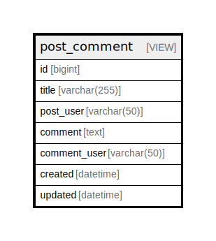

# post_comment

## Description

post and comments View table

<details>
<summary><strong>Table Definition</strong></summary>

```sql
CREATE VIEW post_comment AS (select `c`.`id` AS `id`,`p`.`title` AS `title`,`u2`.`username` AS `post_user`,`c`.`comment` AS `comment`,`u2`.`username` AS `comment_user`,`c`.`created` AS `created`,`c`.`updated` AS `updated` from (((`relations_singular`.`post` `p` left join `relations_singular`.`comment` `c` on((`p`.`id` = `c`.`post_id`))) left join `relations_singular`.`user` `u` on((`u`.`id` = `p`.`user_id`))) left join `relations_singular`.`user` `u2` on((`u2`.`id` = `c`.`user_id`))))
```

</details>

## Columns

| Name | Type | Default | Nullable | Children | Parents | Comment |
| ---- | ---- | ------- | -------- | -------- | ------- | ------- |
| id | bigint | 0 | true |  |  | comment.id |
| title | varchar(255) |  | false |  |  | post.title |
| post_user | varchar(50) |  | true |  |  | post.user.username |
| comment | text |  | true |  |  | Comment<br />Multi-line<br />column<br />comment |
| comment_user | varchar(50) |  | true |  |  | comment.user.username |
| created | datetime |  | true |  |  | comment.created |
| updated | datetime |  | true |  |  | comment.updated |

## Referenced Tables

| Name | Columns | Comment | Type | Labels |
| ---- | ------- | ------- | ---- | ------ |
| [post](post.md) | 7 | Post table | BASE TABLE | `green` `red` `blue` |
| [comment](comment.md) | 6 | Comment<br />Multi-line<br />table<br />comment | BASE TABLE |  |
| [user](user.md) | 6 | User table | BASE TABLE |  |

## Relations



---

> Generated by [tbls](https://github.com/k1LoW/tbls)
