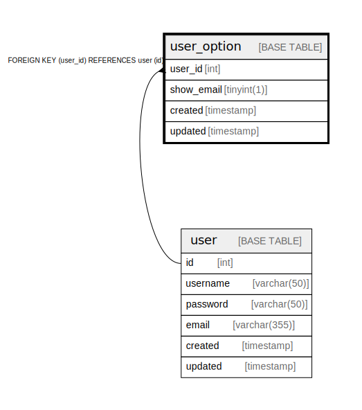

# user_option

## Description

User option table

<details>
<summary><strong>Table Definition</strong></summary>

```sql
CREATE TABLE `user_option` (
  `user_id` int NOT NULL,
  `show_email` tinyint(1) NOT NULL DEFAULT '0',
  `created` timestamp NOT NULL,
  `updated` timestamp NULL DEFAULT NULL,
  PRIMARY KEY (`user_id`),
  UNIQUE KEY `user_id` (`user_id`),
  CONSTRAINT `user_option_user_id_fk` FOREIGN KEY (`user_id`) REFERENCES `user` (`id`) ON DELETE CASCADE
) ENGINE=InnoDB DEFAULT CHARSET=utf8mb4 COLLATE=utf8mb4_0900_ai_ci COMMENT='User option table'
```

</details>

## Columns

| Name | Type | Default | Nullable | Parents |
| ---- | ---- | ------- | -------- | ------- |
| user_id | int |  | false | [user](user.md) |
| show_email | tinyint(1) | 0 | false |  |
| created | timestamp |  | false |  |
| updated | timestamp |  | true |  |

## Constraints

| Name | Type | Definition |
| ---- | ---- | ---------- |
| PRIMARY | PRIMARY KEY | PRIMARY KEY (user_id) |
| user_id | UNIQUE | UNIQUE KEY user_id (user_id) |
| user_option_user_id_fk | FOREIGN KEY | FOREIGN KEY (user_id) REFERENCES user (id) |

## Indexes

| Name | Definition |
| ---- | ---------- |
| PRIMARY | PRIMARY KEY (user_id) USING BTREE |
| user_id | UNIQUE KEY user_id (user_id) USING BTREE |

## Relations



---

> Generated by [tbls](https://github.com/k1LoW/tbls)
