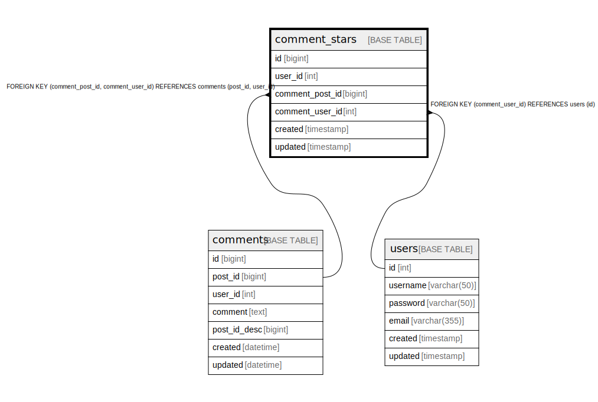

# comment_stars

## 概要

<details>
<summary><strong>テーブル定義</strong></summary>

```sql
CREATE TABLE `comment_stars` (
  `id` bigint NOT NULL AUTO_INCREMENT,
  `user_id` int NOT NULL,
  `comment_post_id` bigint NOT NULL,
  `comment_user_id` int NOT NULL,
  `created` timestamp NOT NULL,
  `updated` timestamp NULL DEFAULT NULL,
  PRIMARY KEY (`id`),
  UNIQUE KEY `user_id` (`user_id`,`comment_post_id`,`comment_user_id`),
  KEY `comment_stars_user_id_post_id_fk` (`comment_post_id`,`comment_user_id`),
  KEY `comment_stars_user_id_fk` (`comment_user_id`),
  CONSTRAINT `comment_stars_user_id_fk` FOREIGN KEY (`comment_user_id`) REFERENCES `users` (`id`),
  CONSTRAINT `comment_stars_user_id_post_id_fk` FOREIGN KEY (`comment_post_id`, `comment_user_id`) REFERENCES `comments` (`post_id`, `user_id`)
) ENGINE=InnoDB DEFAULT CHARSET=utf8mb4 COLLATE=utf8mb4_0900_ai_ci
```

</details>

## カラム一覧

| 名前              | タイプ       | デフォルト値             | Nullable | Extra Definition | 親テーブル                                     |
| --------------- | --------- | ------------------ | -------- | ---------------- | ----------------------------------------- |
| id              | bigint    |                    | false    | auto_increment   |                                           |
| user_id         | int       |                    | false    |                  |                                           |
| comment_post_id | bigint    |                    | false    |                  | [comments](comments.md)                   |
| comment_user_id | int       |                    | false    |                  | [users](users.md) [comments](comments.md) |
| created         | timestamp |                    | false    |                  |                                           |
| updated         | timestamp |                    | true     |                  |                                           |

## 制約一覧

| 名前                               | タイプ         | 定義                                                                                    |
| -------------------------------- | ----------- | ------------------------------------------------------------------------------------- |
| comment_stars_user_id_fk         | FOREIGN KEY | FOREIGN KEY (comment_user_id) REFERENCES users (id)                                   |
| comment_stars_user_id_post_id_fk | FOREIGN KEY | FOREIGN KEY (comment_post_id, comment_user_id) REFERENCES comments (post_id, user_id) |
| PRIMARY                          | PRIMARY KEY | PRIMARY KEY (id)                                                                      |
| user_id                          | UNIQUE      | UNIQUE KEY user_id (user_id, comment_post_id, comment_user_id)                        |

## INDEX一覧

| 名前                               | 定義                                                                                  |
| -------------------------------- | ----------------------------------------------------------------------------------- |
| comment_stars_user_id_fk         | KEY comment_stars_user_id_fk (comment_user_id) USING BTREE                          |
| comment_stars_user_id_post_id_fk | KEY comment_stars_user_id_post_id_fk (comment_post_id, comment_user_id) USING BTREE |
| PRIMARY                          | PRIMARY KEY (id) USING BTREE                                                        |
| user_id                          | UNIQUE KEY user_id (user_id, comment_post_id, comment_user_id) USING BTREE          |

## ER図



---

> Generated by [tbls](https://github.com/k1LoW/tbls)
