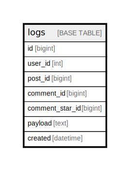

# logs

## 概要

Auditログ

<details>
<summary><strong>テーブル定義</strong></summary>

```sql
CREATE TABLE `logs` (
  `id` bigint NOT NULL AUTO_INCREMENT,
  `user_id` int NOT NULL,
  `post_id` bigint DEFAULT NULL,
  `comment_id` bigint DEFAULT NULL,
  `comment_star_id` bigint DEFAULT NULL,
  `payload` text,
  `created` datetime NOT NULL,
  PRIMARY KEY (`id`)
) ENGINE=InnoDB DEFAULT CHARSET=utf8mb4 COLLATE=utf8mb4_0900_ai_ci COMMENT='Auditログ'
```

</details>

## カラム一覧

| 名前              | タイプ      | デフォルト値       | Nullable | Extra Definition | 子テーブル      | 親テーブル      | コメント     |
| --------------- | -------- | ------------ | -------- | ---------------- | ---------- | ---------- | -------- |
| id              | bigint   |              | false    | auto_increment   |            |            |          |
| user_id         | int      |              | false    |                  |            |            |          |
| post_id         | bigint   |              | true     |                  |            |            |          |
| comment_id      | bigint   |              | true     |                  |            |            |          |
| comment_star_id | bigint   |              | true     |                  |            |            |          |
| payload         | text     |              | true     |                  |            |            |          |
| created         | datetime |              | false    |                  |            |            |          |

## 制約一覧

| 名前      | タイプ         | 定義               |
| ------- | ----------- | ---------------- |
| PRIMARY | PRIMARY KEY | PRIMARY KEY (id) |

## INDEX一覧

| 名前      | 定義                           |
| ------- | ---------------------------- |
| PRIMARY | PRIMARY KEY (id) USING BTREE |

## ER図



---

> Generated by [tbls](https://github.com/k1LoW/tbls)
