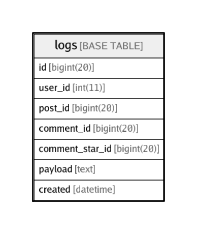

# logs

## 概要

<details>
<summary><strong>Table Definition</strong></summary>

```sql
CREATE TABLE `logs` (
  `id` bigint(20) NOT NULL AUTO_INCREMENT,
  `user_id` int(11) NOT NULL,
  `post_id` bigint(20) DEFAULT NULL,
  `comment_id` bigint(20) DEFAULT NULL,
  `comment_star_id` bigint(20) DEFAULT NULL,
  `payload` text,
  `created` datetime NOT NULL,
  PRIMARY KEY (`id`)
) ENGINE=InnoDB DEFAULT CHARSET=latin1
```

</details>

## カラム一覧

|                 | タイプ        | デフォルト値       | Nullable | 子テーブル      | 親テーブル      | コメント     |
| --------------- | ---------- | ------------ | -------- | ---------- | ---------- | -------- |
| id              | bigint(20) |              | false    |            |            |          |
| user_id         | int(11)    |              | false    |            |            |          |
| post_id         | bigint(20) |              | true     |            |            |          |
| comment_id      | bigint(20) |              | true     |            |            |          |
| comment_star_id | bigint(20) |              | true     |            |            |          |
| payload         | text       |              | true     |            |            |          |
| created         | datetime   |              | false    |            |            |          |

## 制約

|         | タイプ         | 定義               |
| ------- | ----------- | ---------------- |
| PRIMARY | PRIMARY KEY | PRIMARY KEY (id) |

## INDEX

|         | 定義                           |
| ------- | ---------------------------- |
| PRIMARY | PRIMARY KEY (id) USING BTREE |

## 関係



---

> Generated by [tbls](https://github.com/k1LoW/tbls)
