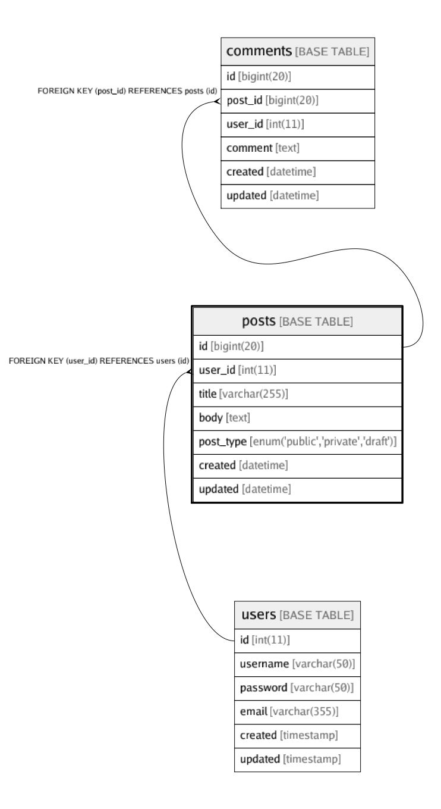

# posts

## 概要

Posts table

<details>
<summary><strong>テーブル定義</strong></summary>

```sql
CREATE TABLE `posts` (
  `id` bigint(20) NOT NULL AUTO_INCREMENT,
  `user_id` int(11) NOT NULL,
  `title` varchar(255) NOT NULL,
  `body` text NOT NULL,
  `post_type` enum('public','private','draft') NOT NULL COMMENT 'public/private/draft',
  `created` datetime NOT NULL,
  `updated` datetime DEFAULT NULL,
  PRIMARY KEY (`id`),
  UNIQUE KEY `user_id` (`user_id`,`title`),
  KEY `posts_user_id_idx` (`id`) USING BTREE,
  CONSTRAINT `posts_user_id_fk` FOREIGN KEY (`user_id`) REFERENCES `users` (`id`) ON DELETE CASCADE ON UPDATE NO ACTION
) ENGINE=InnoDB DEFAULT CHARSET=latin1 COMMENT='Posts table'
```

</details>

## カラム一覧

| 名前        | タイプ                              | デフォルト値       | Nullable | 子テーブル                   | 親テーブル             | コメント                 |
| --------- | -------------------------------- | ------------ | -------- | ----------------------- | ----------------- | -------------------- |
| id        | bigint(20)                       |              | false    | [comments](comments.md) |                   |                      |
| user_id   | int(11)                          |              | false    |                         | [users](users.md) |                      |
| title     | varchar(255)                     |              | false    |                         |                   |                      |
| body      | text                             |              | false    |                         |                   |                      |
| post_type | enum('public','private','draft') |              | false    |                         |                   | public/private/draft |
| created   | datetime                         |              | false    |                         |                   |                      |
| updated   | datetime                         |              | true     |                         |                   |                      |

## 制約一覧

| 名前               | タイプ         | 定義                                          |
| ---------------- | ----------- | ------------------------------------------- |
| posts_user_id_fk | FOREIGN KEY | FOREIGN KEY (user_id) REFERENCES users (id) |
| PRIMARY          | PRIMARY KEY | PRIMARY KEY (id)                            |
| user_id          | UNIQUE      | UNIQUE KEY user_id (user_id, title)         |

## INDEX一覧

| 名前                | 定義                                              |
| ----------------- | ----------------------------------------------- |
| posts_user_id_idx | KEY posts_user_id_idx (id) USING BTREE          |
| PRIMARY           | PRIMARY KEY (id) USING BTREE                    |
| user_id           | UNIQUE KEY user_id (user_id, title) USING BTREE |

## トリガー

| 名前                   | 定義                                                                                                                  |
| -------------------- | ------------------------------------------------------------------------------------------------------------------- |
| update_posts_updated | CREATE TRIGGER update_posts_updated BEFORE UPDATE ON posts<br>FOR EACH ROW<br>SET NEW.updated = CURRENT_TIMESTAMP() |

## ER図



---

> Generated by [tbls](https://github.com/k1LoW/tbls)
