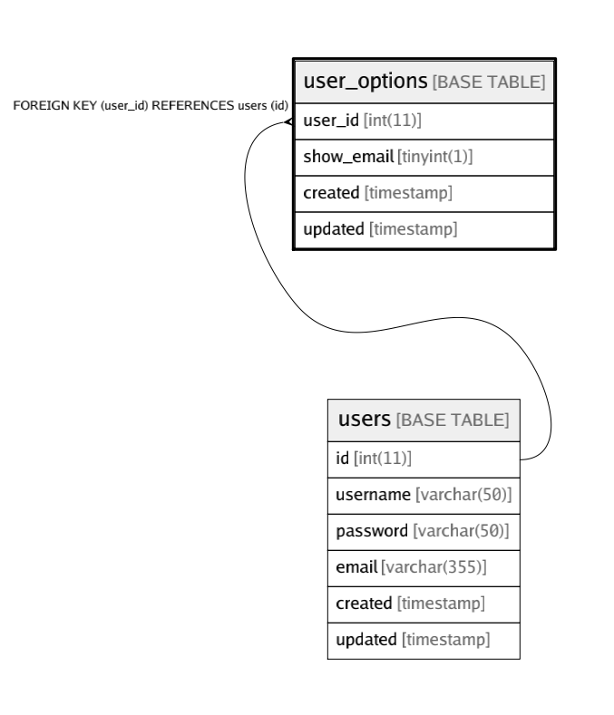

# user_options

## 概要

User options table

<details>
<summary><strong>Table Definition</strong></summary>

```sql
CREATE TABLE `user_options` (
  `user_id` int(11) NOT NULL,
  `show_email` tinyint(1) NOT NULL DEFAULT '0',
  `created` timestamp NOT NULL DEFAULT CURRENT_TIMESTAMP ON UPDATE CURRENT_TIMESTAMP,
  `updated` timestamp NOT NULL DEFAULT '0000-00-00 00:00:00',
  PRIMARY KEY (`user_id`),
  UNIQUE KEY `user_id` (`user_id`),
  CONSTRAINT `user_options_user_id_fk` FOREIGN KEY (`user_id`) REFERENCES `users` (`id`) ON DELETE CASCADE ON UPDATE NO ACTION
) ENGINE=InnoDB DEFAULT CHARSET=latin1 COMMENT='User options table'
```

</details>

## カラム一覧

|            | タイプ        | デフォルト値              | Nullable | 子テーブル      | 親テーブル             | コメント     |
| ---------- | ---------- | ------------------- | -------- | ---------- | ----------------- | -------- |
| user_id    | int(11)    |                     | false    |            | [users](users.md) |          |
| show_email | tinyint(1) | 0                   | false    |            |                   |          |
| created    | timestamp  | CURRENT_TIMESTAMP   | false    |            |                   |          |
| updated    | timestamp  | 0000-00-00 00:00:00 | false    |            |                   |          |

## 制約

|                         | タイプ         | 定義                                          |
| ----------------------- | ----------- | ------------------------------------------- |
| PRIMARY                 | PRIMARY KEY | PRIMARY KEY (user_id)                       |
| user_id                 | UNIQUE      | UNIQUE KEY user_id (user_id)                |
| user_options_user_id_fk | FOREIGN KEY | FOREIGN KEY (user_id) REFERENCES users (id) |

## INDEX

|         | 定義                                       |
| ------- | ---------------------------------------- |
| PRIMARY | PRIMARY KEY (user_id) USING BTREE        |
| user_id | UNIQUE KEY user_id (user_id) USING BTREE |

## 関係



---

> Generated by [tbls](https://github.com/k1LoW/tbls)
