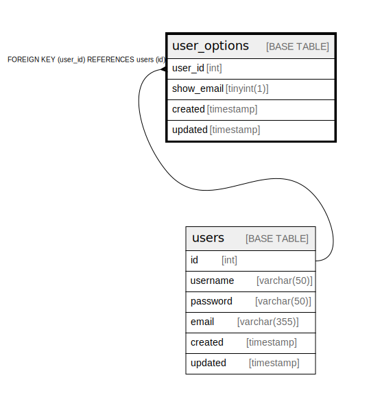

# user_options

## 概要

User options table

<details>
<summary><strong>テーブル定義</strong></summary>

```sql
CREATE TABLE `user_options` (
  `user_id` int NOT NULL,
  `show_email` tinyint(1) NOT NULL DEFAULT '0',
  `created` timestamp NOT NULL,
  `updated` timestamp NULL DEFAULT NULL,
  PRIMARY KEY (`user_id`),
  UNIQUE KEY `user_id` (`user_id`),
  CONSTRAINT `user_options_user_id_fk` FOREIGN KEY (`user_id`) REFERENCES `users` (`id`) ON DELETE CASCADE
) ENGINE=InnoDB DEFAULT CHARSET=utf8mb4 COLLATE=utf8mb4_0900_ai_ci COMMENT='User options table'
```

</details>

## カラム一覧

| 名前         | タイプ        | デフォルト値       | Nullable | 子テーブル      | 親テーブル             | コメント     |
| ---------- | ---------- | ------------ | -------- | ---------- | ----------------- | -------- |
| user_id    | int        |              | false    |            | [users](users.md) |          |
| show_email | tinyint(1) | 0            | false    |            |                   |          |
| created    | timestamp  |              | false    |            |                   |          |
| updated    | timestamp  |              | true     |            |                   |          |

## 制約一覧

| 名前                      | タイプ         | 定義                                          |
| ----------------------- | ----------- | ------------------------------------------- |
| PRIMARY                 | PRIMARY KEY | PRIMARY KEY (user_id)                       |
| user_id                 | UNIQUE      | UNIQUE KEY user_id (user_id)                |
| user_options_user_id_fk | FOREIGN KEY | FOREIGN KEY (user_id) REFERENCES users (id) |

## INDEX一覧

| 名前      | 定義                                       |
| ------- | ---------------------------------------- |
| PRIMARY | PRIMARY KEY (user_id) USING BTREE        |
| user_id | UNIQUE KEY user_id (user_id) USING BTREE |

## ER図



---

> Generated by [tbls](https://github.com/k1LoW/tbls)
