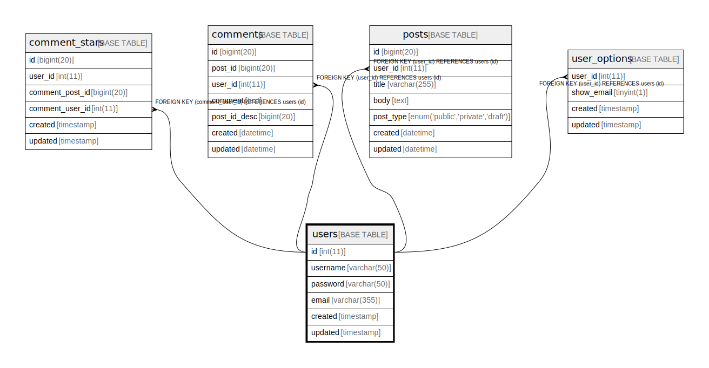

# users

## 概要

Users table

<details>
<summary><strong>テーブル定義</strong></summary>

```sql
CREATE TABLE `users` (
  `id` int NOT NULL AUTO_INCREMENT,
  `username` varchar(50) NOT NULL,
  `password` varchar(50) NOT NULL,
  `email` varchar(355) NOT NULL COMMENT 'ex. user@example.com',
  `created` timestamp NOT NULL,
  `updated` timestamp NULL DEFAULT NULL,
  PRIMARY KEY (`id`),
  UNIQUE KEY `username` (`username`),
  UNIQUE KEY `email` (`email`)
) ENGINE=InnoDB AUTO_INCREMENT=[Redacted by tbls] DEFAULT CHARSET=utf8mb4 COLLATE=utf8mb4_0900_ai_ci COMMENT='Users table'
```

</details>

## カラム一覧

| 名前       | タイプ          | デフォルト値             | Nullable | Extra Definition | 子テーブル                                                                                                       | コメント                 |
| -------- | ------------ | ------------------ | -------- | ---------------- | ----------------------------------------------------------------------------------------------------------- | -------------------- |
| id       | int          |                    | false    | auto_increment   | [comment_stars](comment_stars.md) [comments](comments.md) [posts](posts.md) [user_options](user_options.md) |                      |
| username | varchar(50)  |                    | false    |                  |                                                                                                             |                      |
| password | varchar(50)  |                    | false    |                  |                                                                                                             |                      |
| email    | varchar(355) |                    | false    |                  |                                                                                                             | ex. user@example.com |
| created  | timestamp    |                    | false    |                  |                                                                                                             |                      |
| updated  | timestamp    |                    | true     |                  |                                                                                                             |                      |

## 制約一覧

| 名前       | タイプ         | 定義                             |
| -------- | ----------- | ------------------------------ |
| email    | UNIQUE      | UNIQUE KEY email (email)       |
| PRIMARY  | PRIMARY KEY | PRIMARY KEY (id)               |
| username | UNIQUE      | UNIQUE KEY username (username) |

## INDEX一覧

| 名前       | 定義                                         |
| -------- | ------------------------------------------ |
| PRIMARY  | PRIMARY KEY (id) USING BTREE               |
| email    | UNIQUE KEY email (email) USING BTREE       |
| username | UNIQUE KEY username (username) USING BTREE |

## ER図



---

> Generated by [tbls](https://github.com/k1LoW/tbls)
