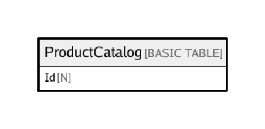

# ProductCatalog

## Description

## Columns

| Name | Type | Default | Nullable | Children | Parents | Comment |
| ---- | ---- | ------- | -------- | -------- | ------- | ------- |
| Id | N |  | false |  |  |  |

## Constraints

| Name | Type | Definition |
| ---- | ---- | ---------- |
| Primary Key | Partition key | [{ AttributeName: "Id", KeyType: "HASH" }] |

## Relations

---

> Generated by [tbls](https://github.com/k1LoW/tbls)
