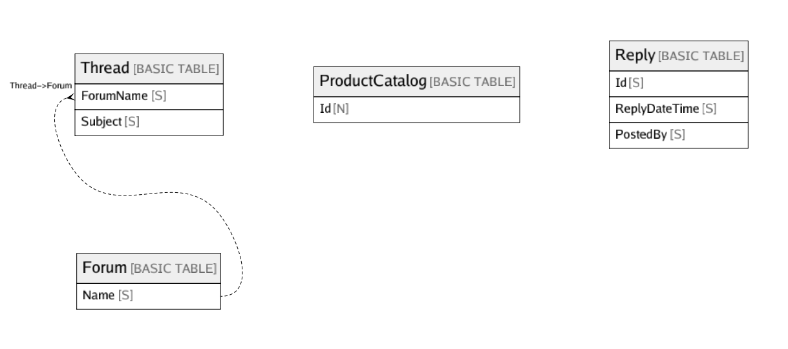

# Amazon DynamoDB (ap-northeast-1)

## Tables

| Name | Attributes | Comment | Type |
| ---- | ------- | ------- | ---- |
| [Forum](Forum.md) | 1 |  | BASIC TABLE |
| [ProductCatalog](ProductCatalog.md) | 1 |  | BASIC TABLE |
| [Reply](Reply.md) | 3 |  | BASIC TABLE |
| [Thread](Thread.md) | 2 |  | BASIC TABLE |

## Relations

---

> Generated by [tbls](https://github.com/k1LoW/tbls)
