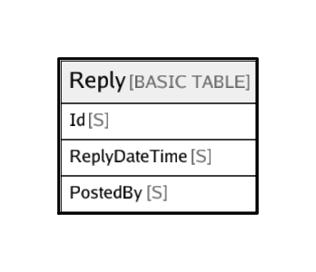

# Reply

## Description

## Columns

| Name | Type | Default | Nullable | Children | Parents | Comment |
| ---- | ---- | ------- | -------- | -------- | ------- | ------- |
| Id | S |  | false |  |  |  |
| ReplyDateTime | S |  | false |  |  |  |
| PostedBy | S |  | false |  |  |  |

## Constraints

| Name | Type | Definition |
| ---- | ---- | ---------- |
| Primary Key | Partition key and sort key | [{ AttributeName: "Id", KeyType: "HASH" } { AttributeName: "ReplyDateTime", KeyType: "RANGE" }] |

## Indexes

| Name | Definition |
| ---- | ---------- |
| PostedBy-index | LocalSecondaryIndex { [{ AttributeName: "Id", KeyType: "HASH" } { AttributeName: "PostedBy", KeyType: "RANGE" }], { ProjectionType: "KEYS_ONLY" } } |

## Relations

---

> Generated by [tbls](https://github.com/k1LoW/tbls)
