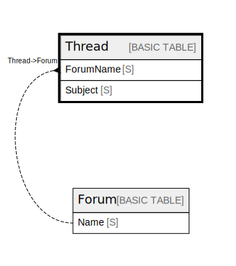

# Thread

## Description

## Attributes

| Name | Type | Default | Nullable | Children | Parents | Comment |
| ---- | ---- | ------- | -------- | -------- | ------- | ------- |
| ForumName | S |  | false |  | [Forum](Forum.md) |  |
| Subject | S |  | false |  |  |  |

## Primary Key

| Name | Type | Definition |
| ---- | ---- | ---------- |
| Primary Key | Partition key and sort key | [{ AttributeName: "ForumName", KeyType: "HASH" } { AttributeName: "Subject", KeyType: "RANGE" }] |

## Relations

---

> Generated by [tbls](https://github.com/k1LoW/tbls)
