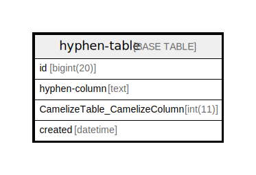

# hyphen-table

## Description

<details>
<summary><strong>Table Definition</strong></summary>

```sql
CREATE TABLE `hyphen-table` (
  `id` bigint(20) NOT NULL AUTO_INCREMENT,
  `hyphen-column` text NOT NULL,
  `CamelizeTable_CamelizeColumn` int(11) NOT NULL,
  `created` datetime NOT NULL,
  PRIMARY KEY (`id`),
  KEY `CamelizeTable_CamelizeColumn_fk` (`CamelizeTable_CamelizeColumn`),
  CONSTRAINT `CamelizeTable_CamelizeColumn_fk` FOREIGN KEY (`CamelizeTable_CamelizeColumn`) REFERENCES `CamelizeTable` (`CamelizeColumn`) ON DELETE CASCADE ON UPDATE NO ACTION
) ENGINE=InnoDB DEFAULT CHARSET=latin1
```

</details>

## Columns

| Name | Type | Default | Nullable | Children | Parents | Comment |
| ---- | ---- | ------- | -------- | -------- | ------- | ------- |
| id | bigint(20) |  | false |  |  |  |
| hyphen-column | text |  | false |  |  |  |
| CamelizeTable_CamelizeColumn | int(11) |  | false |  |  |  |
| created | datetime |  | false |  |  |  |

## Constraints

| Name | Type | Definition |
| ---- | ---- | ---------- |
| CamelizeTable_CamelizeColumn_fk | FOREIGN KEY | FOREIGN KEY (CamelizeTable_CamelizeColumn) REFERENCES CamelizeTable (CamelizeColumn) |
| PRIMARY | PRIMARY KEY | PRIMARY KEY (id) |

## Indexes

| Name | Definition |
| ---- | ---------- |
| CamelizeTable_CamelizeColumn_fk | KEY CamelizeTable_CamelizeColumn_fk (CamelizeTable_CamelizeColumn) USING BTREE |
| PRIMARY | PRIMARY KEY (id) USING BTREE |

## Relations



---

> Generated by [tbls](https://github.com/k1LoW/tbls)
