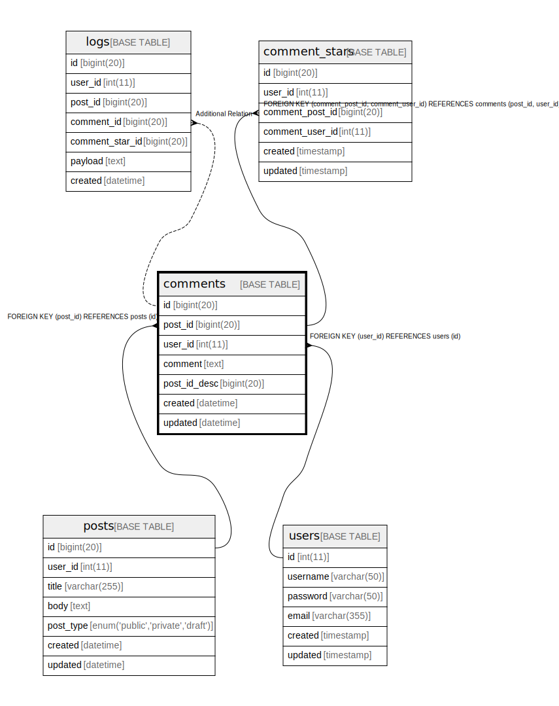

# comments

## Description

Comments  
Multi-line  
table  
comment

<details>
<summary><strong>Table Definition</strong></summary>

```sql
CREATE TABLE `comments` (
  `id` bigint(20) NOT NULL AUTO_INCREMENT,
  `post_id` bigint(20) NOT NULL,
  `user_id` int(11) NOT NULL,
  `comment` text NOT NULL COMMENT 'Comment\nMulti-line\r\ncolumn\rcomment',
  `post_id_desc` bigint(20) GENERATED ALWAYS AS (`post_id` * -1) VIRTUAL,
  `created` datetime NOT NULL,
  `updated` datetime DEFAULT NULL,
  PRIMARY KEY (`id`),
  UNIQUE KEY `post_id` (`post_id`,`user_id`),
  KEY `comments_user_id_fk` (`user_id`),
  KEY `comments_post_id_user_id_idx` (`post_id`,`user_id`) USING HASH,
  CONSTRAINT `comments_post_id_fk` FOREIGN KEY (`post_id`) REFERENCES `posts` (`id`),
  CONSTRAINT `comments_user_id_fk` FOREIGN KEY (`user_id`) REFERENCES `users` (`id`)
) ENGINE=InnoDB DEFAULT CHARSET=utf8mb4 COLLATE=utf8mb4_general_ci COMMENT='Comments\nMulti-line\r\ntable\rcomment'
```

</details>

## Columns

| Name | Type | Default | Nullable | Extra Definition | Children | Parents | Comment |
| ---- | ---- | ------- | -------- | ---------------- | -------- | ------- | ------- |
| id | bigint(20) |  | false | auto_increment | [logs](logs.md) |  |  |
| post_id | bigint(20) |  | false |  | [comment_stars](comment_stars.md) | [posts](posts.md) |  |
| user_id | int(11) |  | false |  | [comment_stars](comment_stars.md) | [users](users.md) |  |
| comment | text |  | false |  |  |  | Comment<br />Multi-line<br />column<br />comment |
| post_id_desc | bigint(20) | NULL | true | GENERATED ALWAYS AS `post_id` * -1 VIRTUAL |  |  |  |
| created | datetime |  | false |  |  |  |  |
| updated | datetime | NULL | true |  |  |  |  |

## Constraints

| Name | Type | Definition |
| ---- | ---- | ---------- |
| comments_post_id_fk | FOREIGN KEY | FOREIGN KEY (post_id) REFERENCES posts (id) |
| comments_user_id_fk | FOREIGN KEY | FOREIGN KEY (user_id) REFERENCES users (id) |
| post_id | UNIQUE | UNIQUE KEY post_id (post_id, user_id) |
| PRIMARY | PRIMARY KEY | PRIMARY KEY (id) |

## Indexes

| Name | Definition |
| ---- | ---------- |
| comments_post_id_user_id_idx | KEY comments_post_id_user_id_idx (post_id, user_id) USING BTREE |
| comments_user_id_fk | KEY comments_user_id_fk (user_id) USING BTREE |
| PRIMARY | PRIMARY KEY (id) USING BTREE |
| post_id | UNIQUE KEY post_id (post_id, user_id) USING BTREE |

## Relations



---

> Generated by [tbls](https://github.com/k1LoW/tbls)
