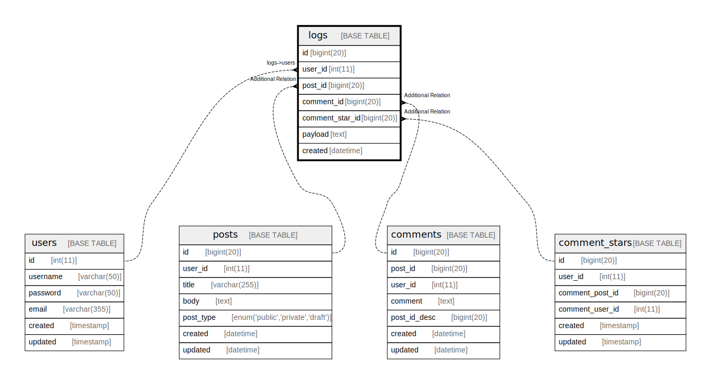

# logs

## Description

Auditログ

<details>
<summary><strong>Table Definition</strong></summary>

```sql
CREATE TABLE `logs` (
  `id` bigint(20) NOT NULL AUTO_INCREMENT,
  `user_id` int(11) NOT NULL,
  `post_id` bigint(20) DEFAULT NULL,
  `comment_id` bigint(20) DEFAULT NULL,
  `comment_star_id` bigint(20) DEFAULT NULL,
  `payload` text DEFAULT NULL,
  `created` datetime NOT NULL,
  PRIMARY KEY (`id`)
) ENGINE=InnoDB DEFAULT CHARSET=utf8mb4 COMMENT='Auditログ'
```

</details>

## Columns

| Name | Type | Default | Nullable | Extra Definition | Children | Parents | Comment |
| ---- | ---- | ------- | -------- | --------------- | -------- | ------- | ------- |
| id | bigint(20) |  | false | auto_increment |  |  |  |
| user_id | int(11) |  | false |  |  | [users](users.md) |  |
| post_id | bigint(20) | NULL | true |  |  | [posts](posts.md) |  |
| comment_id | bigint(20) | NULL | true |  |  | [comments](comments.md) |  |
| comment_star_id | bigint(20) | NULL | true |  |  | [comment_stars](comment_stars.md) |  |
| payload | text | NULL | true |  |  |  |  |
| created | datetime |  | false |  |  |  |  |

## Constraints

| Name | Type | Definition |
| ---- | ---- | ---------- |
| PRIMARY | PRIMARY KEY | PRIMARY KEY (id) |

## Indexes

| Name | Definition |
| ---- | ---------- |
| PRIMARY | PRIMARY KEY (id) USING BTREE |

## Relations



---

> Generated by [tbls](https://github.com/k1LoW/tbls)
