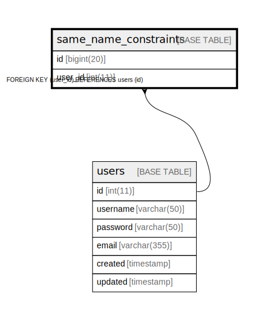

# same_name_constraints

## Description

<details>
<summary><strong>Table Definition</strong></summary>

```sql
CREATE TABLE `same_name_constraints` (
  `id` bigint(20) DEFAULT NULL,
  `user_id` int(11) NOT NULL,
  UNIQUE KEY `same_name` (`user_id`,`id`),
  CONSTRAINT `same_name` FOREIGN KEY (`user_id`) REFERENCES `users` (`id`) ON DELETE CASCADE ON UPDATE NO ACTION
) ENGINE=InnoDB DEFAULT CHARSET=utf8mb4
```

</details>

## Columns

| Name | Type | Default | Nullable | Children | Parents | Comment |
| ---- | ---- | ------- | -------- | -------- | ------- | ------- |
| id | bigint(20) | NULL | true |  |  |  |
| user_id | int(11) |  | false |  | [users](users.md) |  |

## Constraints

| Name | Type | Definition |
| ---- | ---- | ---------- |
| same_name | FOREIGN KEY | FOREIGN KEY (user_id) REFERENCES users (id) |
| same_name | UNIQUE | UNIQUE KEY same_name (user_id, id) |

## Indexes

| Name | Definition |
| ---- | ---------- |
| same_name | UNIQUE KEY same_name (user_id, id) USING BTREE |

## Relations



---

> Generated by [tbls](https://github.com/k1LoW/tbls)
