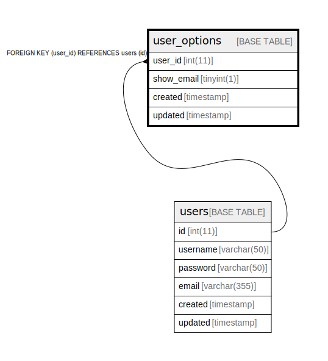

# user_options

## Description

User options table

<details>
<summary><strong>Table Definition</strong></summary>

```sql
CREATE TABLE `user_options` (
  `user_id` int(11) NOT NULL,
  `show_email` tinyint(1) NOT NULL DEFAULT 0,
  `created` timestamp NOT NULL DEFAULT current_timestamp() ON UPDATE current_timestamp(),
  `updated` timestamp NOT NULL DEFAULT '0000-00-00 00:00:00',
  PRIMARY KEY (`user_id`),
  UNIQUE KEY `user_id` (`user_id`),
  CONSTRAINT `user_options_user_id_fk` FOREIGN KEY (`user_id`) REFERENCES `users` (`id`) ON DELETE CASCADE ON UPDATE NO ACTION
) ENGINE=InnoDB DEFAULT CHARSET=utf8mb4 COMMENT='User options table'
```

</details>

## Columns

| Name | Type | Default | Nullable | Extra Definition | Children | Parents | Comment |
| ---- | ---- | ------- | -------- | ---------------- | -------- | ------- | ------- |
| user_id | int(11) |  | false |  |  | [users](users.md) |  |
| show_email | tinyint(1) | 0 | false |  |  |  |  |
| created | timestamp | current_timestamp() | false | on update current_timestamp() |  |  |  |
| updated | timestamp | '0000-00-00 00:00:00' | false |  |  |  |  |

## Constraints

| Name | Type | Definition |
| ---- | ---- | ---------- |
| PRIMARY | PRIMARY KEY | PRIMARY KEY (user_id) |
| user_id | UNIQUE | UNIQUE KEY user_id (user_id) |
| user_options_user_id_fk | FOREIGN KEY | FOREIGN KEY (user_id) REFERENCES users (id) |

## Indexes

| Name | Definition |
| ---- | ---------- |
| PRIMARY | PRIMARY KEY (user_id) USING BTREE |
| user_id | UNIQUE KEY user_id (user_id) USING BTREE |

## Relations



---

> Generated by [tbls](https://github.com/k1LoW/tbls)
