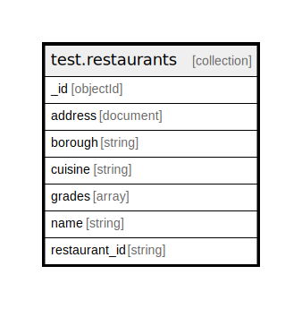

# test.restaurants

## Description

Count of documents is 149

## Attributes

| Name | Type | Default | Nullable | Occurrences | Percents | Children | Parents | Comment |
| ---- | ---- | ------- | -------- | ---------------- | ---------------- | -------- | ------- | ------- |
| _id | objectId |  | false | 149 | 100.0 |  |  |  |
| address | document |  | false | 149 | 100.0 |  |  |  |
| borough | string |  | false | 149 | 100.0 |  |  |  |
| cuisine | string |  | false | 149 | 100.0 |  |  |  |
| grades | array |  | false | 149 | 100.0 |  |  |  |
| name | string |  | false | 149 | 100.0 |  |  |  |
| restaurant_id | string |  | false | 149 | 100.0 |  |  |  |

## Indexes

| Name | Definition | Comment |
| ---- | ---------- | ------- |
| _id_ | {"_id": {"$numberInt":"1"}} | Non-unique, Version 2 |

## Relations

---

> Generated by [tbls](https://github.com/k1LoW/tbls)
