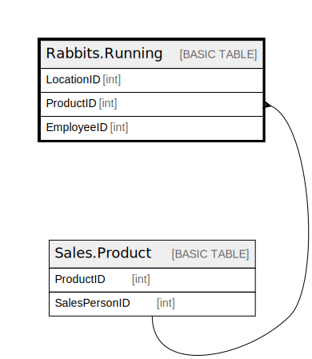

# Rabbits.Running

## Description

## Columns

| Name | Type | Default | Nullable | Children | Parents | Comment |
| ---- | ---- | ------- | -------- | -------- | ------- | ------- |
| LocationID | int |  | false |  |  |  |
| ProductID | int |  | true |  | [Sales.Product](Sales.Product.md) |  |
| EmployeeID | int |  | true |  |  |  |

## Constraints

| Name | Type | Definition |
| ---- | ---- | ---------- |
| PK__Running_* | PRIMARY KEY | CLUSTERED, unique, part of a PRIMARY KEY constraint, [ LocationID ] |
| UQ__Running_* | UNIQUE | NONCLUSTERED, unique, part of a UNIQUE constraint, [ EmployeeID ] |
| UQ__Running_* | UNIQUE | NONCLUSTERED, unique, part of a UNIQUE constraint, [ ProductID ] |
| FK_TempSales_SalesReason | FOREIGN KEY | FOREIGN KEY(ProductID) REFERENCES Sales.Product(SalesPersonID) ON UPDATE NO_ACTION ON DELETE NO_ACTION |

## Indexes

| Name | Definition |
| ---- | ---------- |
| PK__Running_* | CLUSTERED, unique, part of a PRIMARY KEY constraint, [ LocationID ] |
| UQ__Running_* | NONCLUSTERED, unique, part of a UNIQUE constraint, [ EmployeeID ] |
| UQ__Running_* | NONCLUSTERED, unique, part of a UNIQUE constraint, [ ProductID ] |

## Relations

---

> Generated by [tbls](https://github.com/k1LoW/tbls)
