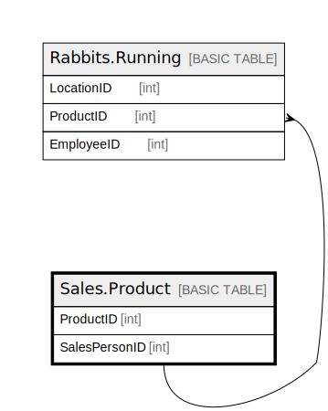

# Sales.Product

## Description

## Columns

| Name | Type | Default | Nullable | Children | Parents | Comment |
| ---- | ---- | ------- | -------- | -------- | ------- | ------- |
| ProductID | int |  | false |  |  |  |
| SalesPersonID | int |  | true | [Rabbits.Running](Rabbits.Running.md) |  |  |

## Constraints

| Name | Type | Definition |
| ---- | ---- | ---------- |
| PK__Product_* | PRIMARY KEY | CLUSTERED, unique, part of a PRIMARY KEY constraint, [ ProductID ] |
| UQ__Product_* | UNIQUE | NONCLUSTERED, unique, part of a UNIQUE constraint, [ SalesPersonID ] |

## Indexes

| Name | Definition |
| ---- | ---------- |
| PK__Product_* | CLUSTERED, unique, part of a PRIMARY KEY constraint, [ ProductID ] |
| UQ__Product_* | NONCLUSTERED, unique, part of a UNIQUE constraint, [ SalesPersonID ] |

## Relations

---

> Generated by [tbls](https://github.com/k1LoW/tbls)
