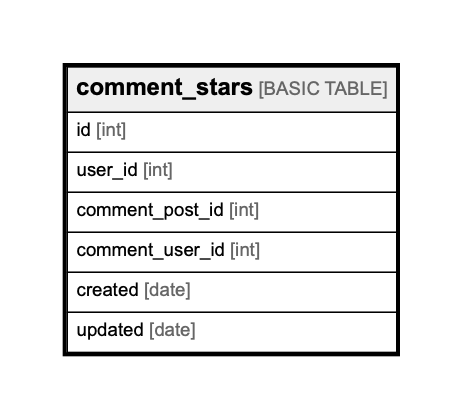

# comment_stars

## Description

## Columns

| Name | Type | Default | Nullable | Children | Parents | Comment |
| ---- | ---- | ------- | -------- | -------- | ------- | ------- |
| id | int |  | false |  |  |  |
| user_id | int |  | false |  |  |  |
| comment_post_id | int |  | false |  |  |  |
| comment_user_id | int |  | false |  |  |  |
| created | date |  | false |  |  |  |
| updated | date |  | true |  |  |  |

## Relations

---

> Generated by [tbls](https://github.com/k1LoW/tbls)
