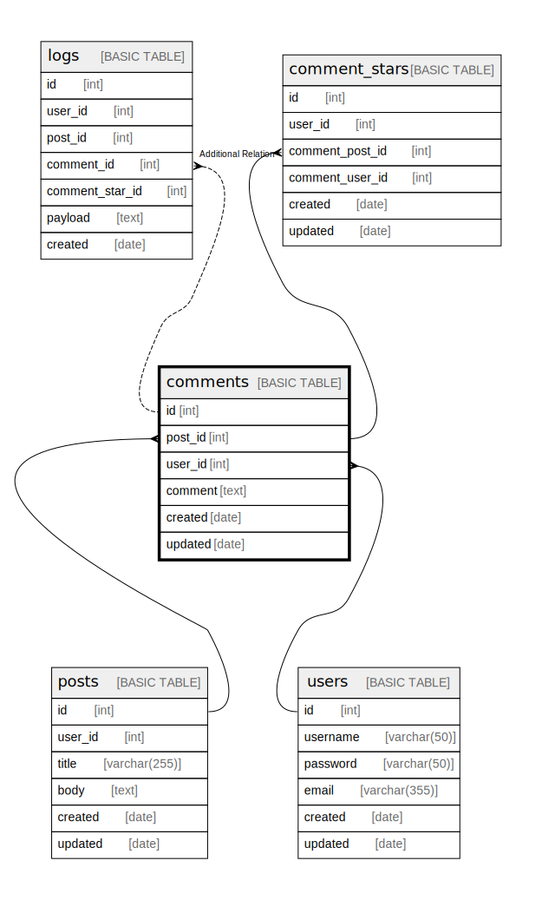

# comments

## Description

## Columns

| Name | Type | Default | Nullable | Children | Parents | Comment |
| ---- | ---- | ------- | -------- | -------- | ------- | ------- |
| id | int |  | false | [logs](logs.md) |  |  |
| post_id | int |  | false | [comment_stars](comment_stars.md) | [posts](posts.md) |  |
| user_id | int |  | false | [comment_stars](comment_stars.md) | [users](users.md) |  |
| comment | text |  | false |  |  |  |
| created | date |  | false |  |  |  |
| updated | date |  | true |  |  |  |

## Constraints

| Name | Type | Definition |
| ---- | ---- | ---------- |
| comments_id_pk | PRIMARY KEY | CLUSTERED, unique, part of a PRIMARY KEY constraint, [ id ] |
| UQ__comments_* | UNIQUE | NONCLUSTERED, unique, part of a UNIQUE constraint, [ post_id, user_id ] |
| comments_post_id_fk | FOREIGN KEY | FOREIGN KEY(post_id) REFERENCES posts(id) ON UPDATE NO_ACTION ON DELETE NO_ACTION |
| comments_user_id_fk | FOREIGN KEY | FOREIGN KEY(user_id) REFERENCES users(id) ON UPDATE NO_ACTION ON DELETE NO_ACTION |

## Indexes

| Name | Definition |
| ---- | ---------- |
| comments_id_pk | CLUSTERED, unique, part of a PRIMARY KEY constraint, [ id ] |
| UQ__comments_* | NONCLUSTERED, unique, part of a UNIQUE constraint, [ post_id, user_id ] |
| comments_post_id_user_id_idx | NONCLUSTERED, [ post_id, user_id ] |

## Relations

---

> Generated by [tbls](https://github.com/k1LoW/tbls)
