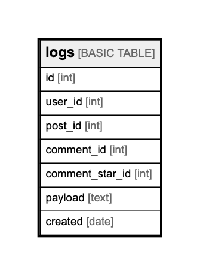

# logs

## Description

## Columns

| Name | Type | Default | Nullable | Children | Parents | Comment |
| ---- | ---- | ------- | -------- | -------- | ------- | ------- |
| id | int |  | false |  |  |  |
| user_id | int |  | false |  | [users](users.md) |  |
| post_id | int |  | true |  | [posts](posts.md) |  |
| comment_id | int |  | true |  | [comments](comments.md) |  |
| comment_star_id | int |  | true |  | [comment_stars](comment_stars.md) |  |
| payload | text |  | true |  |  |  |
| created | date |  | false |  |  |  |

## Relations

---

> Generated by [tbls](https://github.com/k1LoW/tbls)
