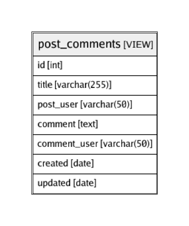

# post_comments

## Description

<details>
<summary><strong>Table Definition</strong></summary>

```sql
CREATE VIEW post_comments AS (
  SELECT c.id, p.title, u2.username AS post_user, c.comment, u2.username AS comment_user, c.created, c.updated
  FROM posts AS p
  LEFT JOIN comments AS c on p.id = c.post_id
  LEFT JOIN users AS u on u.id = p.user_id
  LEFT JOIN users AS u2 on u2.id = c.user_id
);
```

</details>

## Columns

| Name | Type | Default | Nullable | Children | Parents | Comment |
| ---- | ---- | ------- | -------- | -------- | ------- | ------- |
| id | int |  | true |  |  |  |
| title | varchar(255) |  | false |  |  |  |
| post_user | varchar(50) |  | true |  |  |  |
| comment | text |  | true |  |  |  |
| comment_user | varchar(50) |  | true |  |  |  |
| created | date |  | true |  |  |  |
| updated | date |  | true |  |  |  |

## Relations



---

> Generated by [tbls](https://github.com/k1LoW/tbls)
