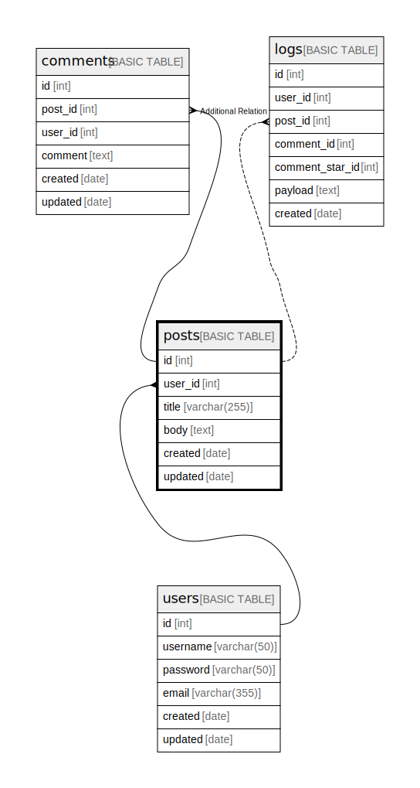

# posts

## Description

## Labels

`green` `red` `blue`

## Columns

| Name | Type | Default | Nullable | Children | Parents | Comment |
| ---- | ---- | ------- | -------- | -------- | ------- | ------- |
| id | int |  | false | [comments](comments.md) [logs](logs.md) |  |  |
| user_id | int |  | false |  | [users](users.md) |  |
| title | varchar(255) |  | false |  |  |  |
| body | text |  | false |  |  | post body |
| created | date |  | false |  |  |  |
| updated | date |  | true |  |  |  |

## Constraints

| Name | Type | Definition |
| ---- | ---- | ---------- |
| posts_id_pk | PRIMARY KEY | CLUSTERED, unique, part of a PRIMARY KEY constraint, [ id ] |
| UQ__posts_* | UNIQUE | NONCLUSTERED, unique, part of a UNIQUE constraint, [ user_id, title ] |
| posts_user_id_fk | FOREIGN KEY | FOREIGN KEY(user_id) REFERENCES users(id) ON UPDATE NO_ACTION ON DELETE CASCADE |

## Indexes

| Name | Definition |
| ---- | ---------- |
| posts_id_pk | CLUSTERED, unique, part of a PRIMARY KEY constraint, [ id ] |
| UQ__posts_* | NONCLUSTERED, unique, part of a UNIQUE constraint, [ user_id, title ] |
| posts_user_id_idx | NONCLUSTERED, [ user_id ] |

## Triggers

| Name | Definition |
| ---- | ---------- |
| update_posts_updated | CREATE TRIGGER update_posts_updated ON posts AFTER UPDATE AS BEGIN   UPDATE users SET updated = GETDATE()   WHERE id = ( SELECT user_id FROM deleted) END; |

## Relations

---

> Generated by [tbls](https://github.com/k1LoW/tbls)
