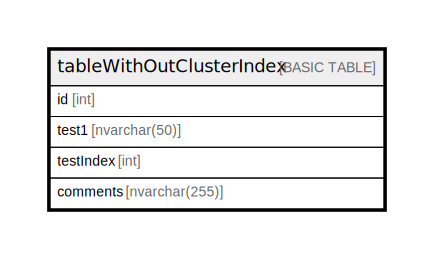

# tableWithOutClusterIndex

## Description

## Columns

| Name | Type | Default | Nullable | Children | Parents | Comment |
| ---- | ---- | ------- | -------- | -------- | ------- | ------- |
| id | int |  | false |  |  |  |
| test1 | nvarchar(50) |  | false |  |  |  |
| testIndex | int |  | false |  |  |  |
| comments | nvarchar(255) |  | true |  |  |  |

## Constraints

| Name | Type | Definition |
| ---- | ---- | ---------- |
| PK_tableWithOutClusterIndex | PRIMARY KEY | NONCLUSTERED, unique, part of a PRIMARY KEY constraint, [ id ] |

## Indexes

| Name | Definition |
| ---- | ---------- |
| PK_tableWithOutClusterIndex | NONCLUSTERED, unique, part of a PRIMARY KEY constraint, [ id ] |
| IX_tableWithOutClusterIndex_testIndex | NONCLUSTERED, [ testIndex ] |
| IX_tableWithOutClusterIndex_testIndex_id | NONCLUSTERED, [ testIndex, id ] |

## Relations

---

> Generated by [tbls](https://github.com/k1LoW/tbls)
