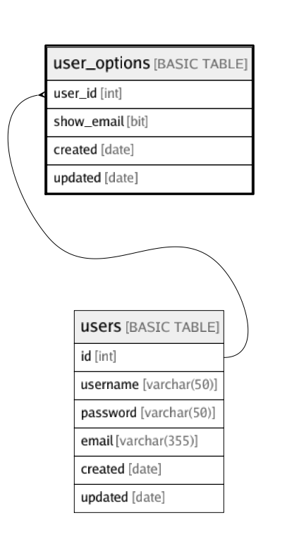

# user_options

## Description

## Columns

| Name | Type | Default | Nullable | Children | Parents | Comment |
| ---- | ---- | ------- | -------- | -------- | ------- | ------- |
| user_id | int |  | false |  | [users](users.md) |  |
| show_email | bit | ((0)) | false |  |  |  |
| created | date |  | false |  |  |  |
| updated | date |  | true |  |  |  |

## Constraints

| Name | Type | Definition |
| ---- | ---- | ---------- |
| PK__user_opt__B9BE370F456BBA9A | PRIMARY KEY | CLUSTERED, unique, part of a PRIMARY KEY constraint, [ user_id ] |
| user_options_user_id_fk | FOREIGN KEY | FOREIGN KEY(user_id) REFERENCES users(id) ON UPDATE NO_ACTION ON DELETE CASCADE |

## Indexes

| Name | Definition |
| ---- | ---------- |
| PK__user_opt__B9BE370F456BBA9A | CLUSTERED, unique, part of a PRIMARY KEY constraint, [ user_id ] |

## Relations

---

> Generated by [tbls](https://github.com/k1LoW/tbls)
