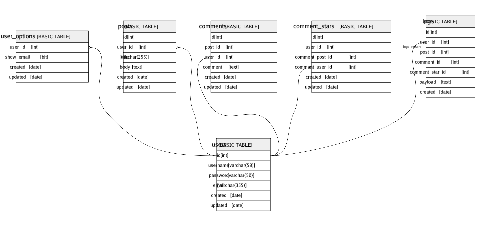

# users

## Description

## Columns

| Name | Type | Default | Nullable | Children | Parents | Comment |
| ---- | ---- | ------- | -------- | -------- | ------- | ------- |
| id | int |  | false | [comment_stars](comment_stars.md) [user_options](user_options.md) [posts](posts.md) [comments](comments.md) [logs](logs.md) |  |  |
| username | varchar(50) |  | false |  |  |  |
| password | varchar(50) |  | false |  |  |  |
| email | varchar(355) |  | false |  |  |  |
| created | date |  | false |  |  |  |
| updated | date |  | true |  |  |  |

## Constraints

| Name | Type | Definition |
| ---- | ---- | ---------- |
| PK__users_* | PRIMARY KEY | CLUSTERED, unique, part of a PRIMARY KEY constraint, [ id ] |
| UQ__users_* | UNIQUE | NONCLUSTERED, unique, part of a UNIQUE constraint, [ email ] |
| UQ__users_* | UNIQUE | NONCLUSTERED, unique, part of a UNIQUE constraint, [ username ] |
| CK__users__username_* | CHECK | CHECK(len([username])>(4)) |

## Indexes

| Name | Definition |
| ---- | ---------- |
| PK__users_* | CLUSTERED, unique, part of a PRIMARY KEY constraint, [ id ] |
| UQ__users_* | NONCLUSTERED, unique, part of a UNIQUE constraint, [ email ] |
| UQ__users_* | NONCLUSTERED, unique, part of a UNIQUE constraint, [ username ] |

## Triggers

| Name | Definition |
| ---- | ---------- |
| update_users_updated | CREATE TRIGGER update_users_updated ON users AFTER UPDATE AS BEGIN   UPDATE users SET updated = GETDATE()   WHERE id = ( SELECT id FROM deleted) END; |

## Relations

---

> Generated by [tbls](https://github.com/k1LoW/tbls)
