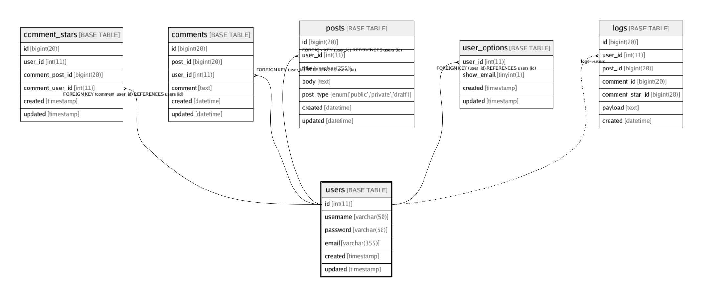

# users

## Description

Users table

## Columns

| Name | Type | Default | Nullable | Children | Parents | Comment |
| ---- | ---- | ------- | -------- | -------- | ------- | ------- |
| id | int(11) |  | false | [comment_stars](comment_stars.md) [comments](comments.md) [posts](posts.md) [logs](logs.md)  |  |  |
| username | varchar(50) |  | false |  |  |  |
| password | varchar(50) |  | false |  |  |  |
| email | varchar(355) |  | false |  |  | ex. user@example.com |
| created | timestamp | CURRENT_TIMESTAMP | false |  |  |  |
| updated | timestamp | 0000-00-00 00:00:00 | false |  |  |  |

## Constraints

| Name | Type | Def |
| ---- | ---- | --- |
| email | UNIQUE | UNIQUE KEY email (email) |
| PRIMARY | PRIMARY KEY | PRIMARY KEY (id) |
| username | UNIQUE | UNIQUE KEY username (username) |

## Indexes

| Name | Def |
| ---- | --- |
| PRIMARY | PRIMARY KEY (id) USING BTREE |
| email | UNIQUE KEY email (email) USING BTREE |
| username | UNIQUE KEY username (username) USING BTREE |

## Relations

---

> Generated by [tbls](https://github.com/k1LoW/tbls)