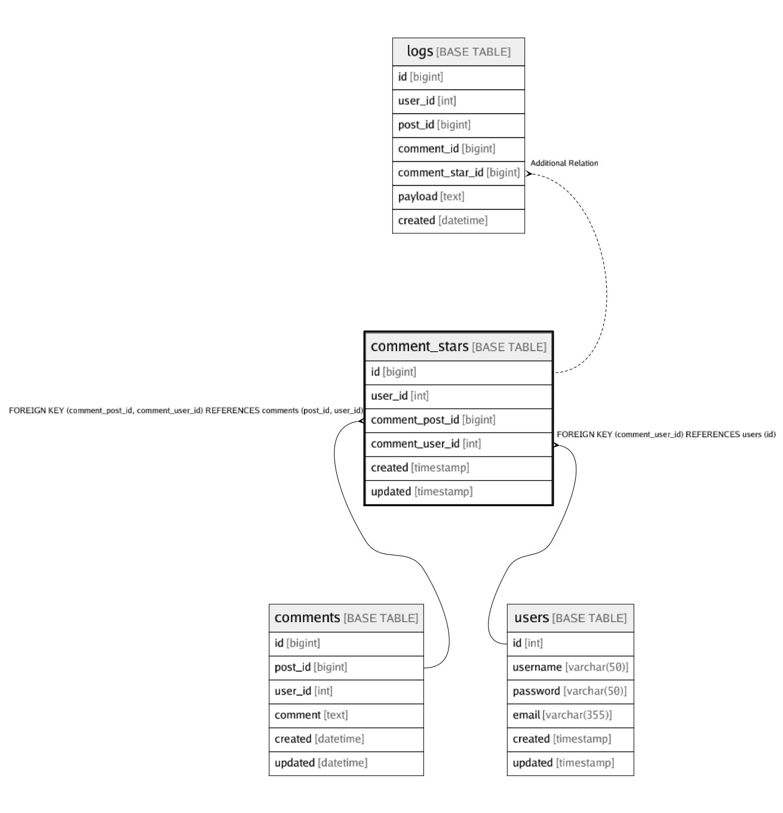

# comment_stars

## Description


<details>
<summary><strong>Table Definition</strong></summary>

```sql
CREATE TABLE `comment_stars` (
  `id` bigint(20) NOT NULL AUTO_INCREMENT,
  `user_id` int(11) NOT NULL,
  `comment_post_id` bigint(20) NOT NULL,
  `comment_user_id` int(11) NOT NULL,
  `created` timestamp NOT NULL,
  `updated` timestamp NULL DEFAULT NULL,
  PRIMARY KEY (`id`),
  UNIQUE KEY `user_id` (`user_id`,`comment_post_id`,`comment_user_id`),
  KEY `comment_stars_user_id_post_id_fk` (`comment_post_id`,`comment_user_id`),
  KEY `comment_stars_user_id_fk` (`comment_user_id`),
  CONSTRAINT `comment_stars_user_id_fk` FOREIGN KEY (`comment_user_id`) REFERENCES `users` (`id`),
  CONSTRAINT `comment_stars_user_id_post_id_fk` FOREIGN KEY (`comment_post_id`, `comment_user_id`) REFERENCES `comments` (`post_id`, `user_id`)
) ENGINE=InnoDB DEFAULT CHARSET=utf8mb4 COLLATE=utf8mb4_0900_ai_ci
```

</details>


## Columns

| Name | Type | Default | Nullable | Children | Parents | Comment |
| ---- | ---- | ------- | -------- | -------- | ------- | ------- |
| id | bigint(20) |  | false | [logs](logs.md)  |  |  |
| user_id | int(11) |  | false |  |  |  |
| comment_post_id | bigint(20) |  | false |  | [comments](comments.md)  |  |
| comment_user_id | int(11) |  | false |  | [users](users.md) [comments](comments.md)  |  |
| created | timestamp |  | false |  |  |  |
| updated | timestamp |  | true |  |  |  |

## Constraints

| Name | Type | Definition |
| ---- | ---- | --- |
| comment_stars_user_id_fk | FOREIGN KEY | FOREIGN KEY (comment_user_id) REFERENCES users (id) |
| comment_stars_user_id_post_id_fk | FOREIGN KEY | FOREIGN KEY (comment_post_id, comment_user_id) REFERENCES comments (post_id, user_id) |
| PRIMARY | PRIMARY KEY | PRIMARY KEY (id) |
| user_id | UNIQUE | UNIQUE KEY user_id (user_id, comment_post_id, comment_user_id) |

## Indexes

| Name | Definition |
| ---- | --- |
| comment_stars_user_id_fk | KEY comment_stars_user_id_fk (comment_user_id) USING BTREE |
| comment_stars_user_id_post_id_fk | KEY comment_stars_user_id_post_id_fk (comment_post_id, comment_user_id) USING BTREE |
| PRIMARY | PRIMARY KEY (id) USING BTREE |
| user_id | UNIQUE KEY user_id (user_id, comment_post_id, comment_user_id) USING BTREE |

## Relations



---

> Generated by [tbls](https://github.com/k1LoW/tbls)