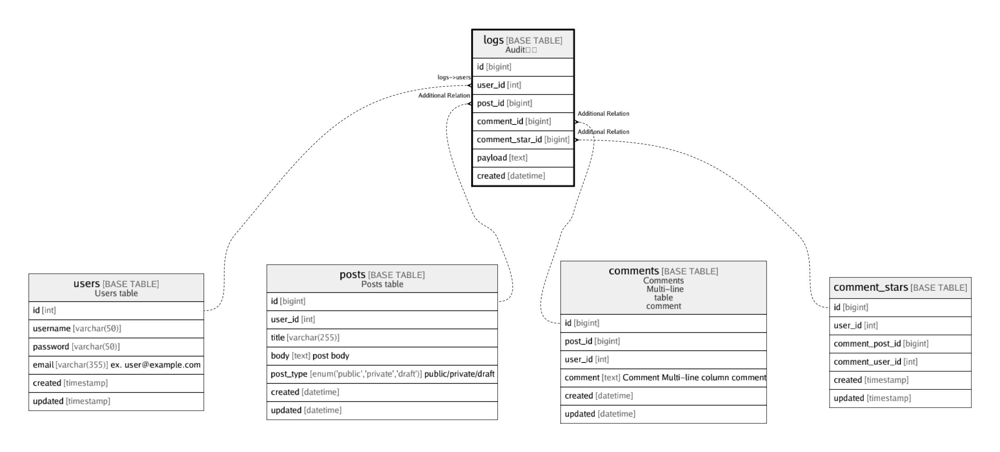

# logs

## Description

audit log table
<details>
<summary><strong>Table Definition</strong></summary>

```sql
CREATE TABLE `logs` (
  `id` bigint(20) NOT NULL AUTO_INCREMENT,
  `user_id` int(11) NOT NULL,
  `post_id` bigint(20) DEFAULT NULL,
  `comment_id` bigint(20) DEFAULT NULL,
  `comment_star_id` bigint(20) DEFAULT NULL,
  `payload` text,
  `created` datetime NOT NULL,
  PRIMARY KEY (`id`)
) ENGINE=InnoDB DEFAULT CHARSET=utf8mb4 COLLATE=utf8mb4_0900_ai_ci
```

</details>


## Columns

| Name | Type | Default | Nullable | Children | Parents | Comment |
| ---- | ---- | ------- | -------- | -------- | ------- | ------- |
| id | bigint(20) |  | false |  |  |  |
| user_id | int(11) |  | false |  | [users](users.md)  |  |
| post_id | bigint(20) |  | true |  | [posts](posts.md)  |  |
| comment_id | bigint(20) |  | true |  | [comments](comments.md)  |  |
| comment_star_id | bigint(20) |  | true |  | [comment_stars](comment_stars.md)  |  |
| payload | text |  | true |  |  |  |
| created | datetime |  | false |  |  |  |

## Constraints

| Name | Type | Definition |
| ---- | ---- | --- |
| PRIMARY | PRIMARY KEY | PRIMARY KEY (id) |

## Indexes

| Name | Definition |
| ---- | --- |
| PRIMARY | PRIMARY KEY (id) USING BTREE |

## Relations



---

> Generated by [tbls](https://github.com/k1LoW/tbls)