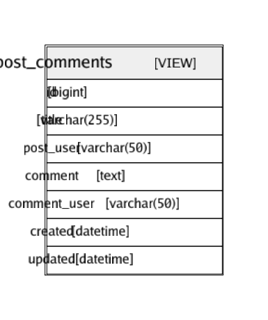

# post_comments

## Description

post and comments View table
<details>
<summary><strong>Table Definition</strong></summary>

```sql
CREATE VIEW post_comments AS (select `c`.`id` AS `id`,`p`.`title` AS `title`,`u2`.`username` AS `post_user`,`c`.`comment` AS `comment`,`u2`.`username` AS `comment_user`,`c`.`created` AS `created`,`c`.`updated` AS `updated` from (((`testdb`.`posts` `p` left join `testdb`.`comments` `c` on((`p`.`id` = `c`.`post_id`))) left join `testdb`.`users` `u` on((`u`.`id` = `p`.`user_id`))) left join `testdb`.`users` `u2` on((`u2`.`id` = `c`.`user_id`))))
```

</details>


## Columns

| Name | Type | Default | Nullable | Children | Parents | Comment |
| ---- | ---- | ------- | -------- | -------- | ------- | ------- |
| id | bigint(20) | 0 | true |  |  | comments.id |
| title | varchar(255) |  | false |  |  | posts.title |
| post_user | varchar(50) |  | true |  |  | posts.users.username |
| comment | text |  | true |  |  |  |
| comment_user | varchar(50) |  | true |  |  | comments.users.username |
| created | datetime |  | true |  |  | comments.created |
| updated | datetime |  | true |  |  | comments.updated |

## Constraints

| Name | Type | Definition |
| ---- | ---- | --- |

## Indexes

| Name | Definition |
| ---- | --- |

## Relations



---

> Generated by [tbls](https://github.com/k1LoW/tbls)