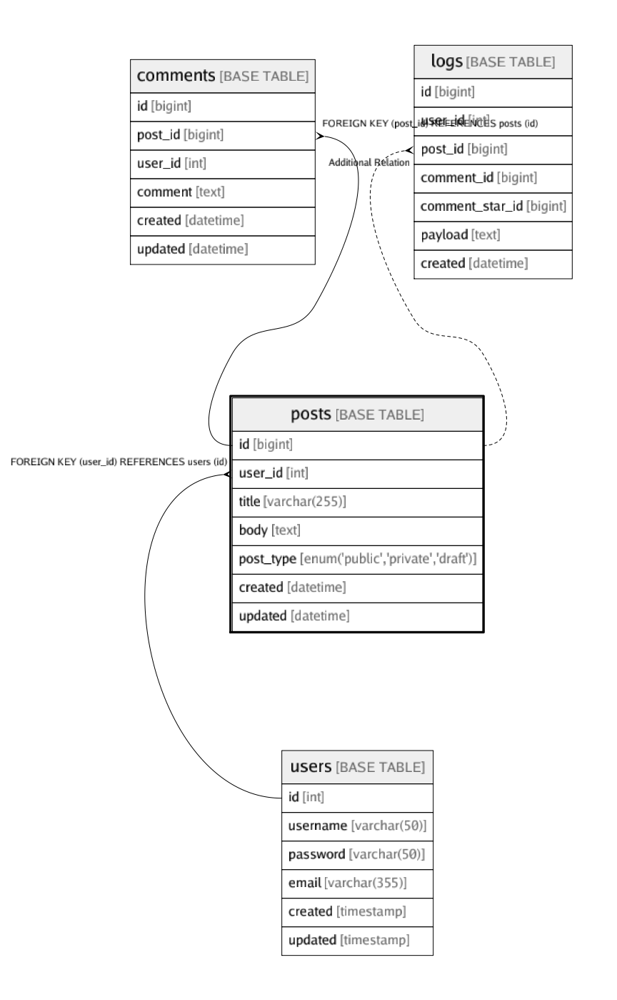

# posts

## Description

Posts table
<details>
<summary><strong>Table Definition</strong></summary>

```sql
CREATE TABLE `posts` (
  `id` bigint(20) NOT NULL AUTO_INCREMENT,
  `user_id` int(11) NOT NULL,
  `title` varchar(255) NOT NULL,
  `body` text NOT NULL,
  `post_type` enum('public','private','draft') NOT NULL COMMENT 'public/private/draft',
  `created` datetime NOT NULL,
  `updated` datetime DEFAULT NULL,
  PRIMARY KEY (`id`),
  UNIQUE KEY `user_id` (`user_id`,`title`),
  KEY `posts_user_id_idx` (`id`) USING BTREE,
  CONSTRAINT `posts_user_id_fk` FOREIGN KEY (`user_id`) REFERENCES `users` (`id`) ON DELETE CASCADE
) ENGINE=InnoDB DEFAULT CHARSET=utf8mb4 COLLATE=utf8mb4_0900_ai_ci COMMENT='Posts table'
```

</details>


## Columns

| Name | Type | Default | Nullable | Children | Parents | Comment |
| ---- | ---- | ------- | -------- | -------- | ------- | ------- |
| id | bigint(20) |  | false | [comments](comments.md) [logs](logs.md)  |  |  |
| user_id | int(11) |  | false |  | [users](users.md)  |  |
| title | varchar(255) |  | false |  |  |  |
| body | text |  | false |  |  | post body |
| post_type | enum('public','private','draft') |  | false |  |  | public/private/draft |
| created | datetime |  | false |  |  |  |
| updated | datetime |  | true |  |  |  |

## Constraints

| Name | Type | Definition |
| ---- | ---- | --- |
| posts_user_id_fk | FOREIGN KEY | FOREIGN KEY (user_id) REFERENCES users (id) |
| PRIMARY | PRIMARY KEY | PRIMARY KEY (id) |
| user_id | UNIQUE | UNIQUE KEY user_id (user_id, title) |

## Indexes

| Name | Definition |
| ---- | --- |
| posts_user_id_idx | KEY posts_user_id_idx (id) USING BTREE |
| PRIMARY | PRIMARY KEY (id) USING BTREE |
| user_id | UNIQUE KEY user_id (user_id, title) USING BTREE |

## Relations



---

> Generated by [tbls](https://github.com/k1LoW/tbls)