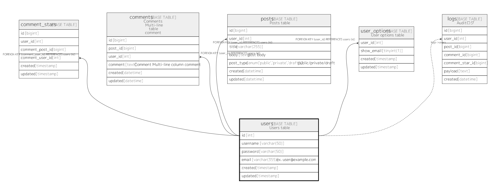

# users

## Description

Users table
<details>
<summary><strong>Table Definition</strong></summary>

```sql
CREATE TABLE `users` (
  `id` int(11) NOT NULL AUTO_INCREMENT,
  `username` varchar(50) NOT NULL,
  `password` varchar(50) NOT NULL,
  `email` varchar(355) NOT NULL COMMENT 'ex. user@example.com',
  `created` timestamp NOT NULL,
  `updated` timestamp NULL DEFAULT NULL,
  PRIMARY KEY (`id`),
  UNIQUE KEY `username` (`username`),
  UNIQUE KEY `email` (`email`)
) ENGINE=InnoDB DEFAULT CHARSET=utf8mb4 COLLATE=utf8mb4_0900_ai_ci COMMENT='Users table'
```

</details>


## Columns

| Name | Type | Default | Nullable | Children | Parents | Comment |
| ---- | ---- | ------- | -------- | -------- | ------- | ------- |
| id | int(11) |  | false | [comment_stars](comment_stars.md) [comments](comments.md) [posts](posts.md) [logs](logs.md)  |  |  |
| username | varchar(50) |  | false |  |  |  |
| password | varchar(50) |  | false |  |  |  |
| email | varchar(355) |  | false |  |  | ex. user@example.com |
| created | timestamp |  | false |  |  |  |
| updated | timestamp |  | true |  |  |  |

## Constraints

| Name | Type | Definition |
| ---- | ---- | --- |
| email | UNIQUE | UNIQUE KEY email (email) |
| PRIMARY | PRIMARY KEY | PRIMARY KEY (id) |
| username | UNIQUE | UNIQUE KEY username (username) |

## Indexes

| Name | Definition |
| ---- | --- |
| PRIMARY | PRIMARY KEY (id) USING BTREE |
| email | UNIQUE KEY email (email) USING BTREE |
| username | UNIQUE KEY username (username) USING BTREE |

## Relations



---

> Generated by [tbls](https://github.com/k1LoW/tbls)