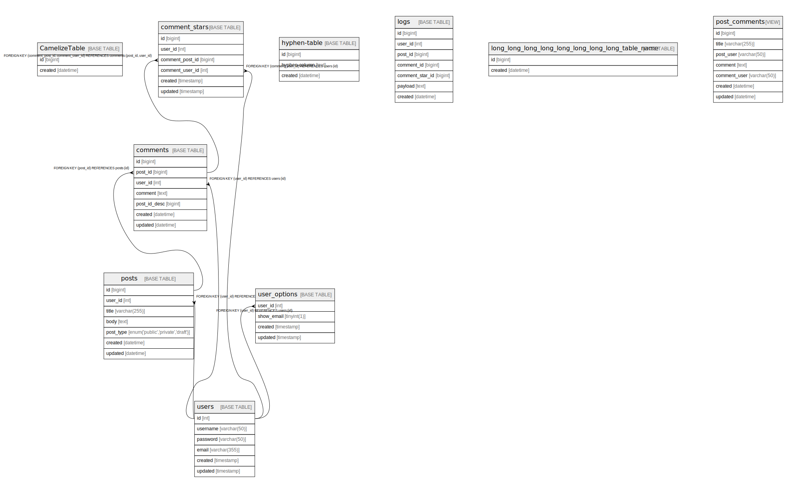

# testdb

## Description

Sample database document.

## Labels

`sample` `tbls`

## Tables

| # | Name | Columns | Comment | Type | Labels |
| - | ---- | ------- | ------- | ---- | ------ |
| 1 | [CamelizeTable](CamelizeTable.md) | 2 |  | BASE TABLE |  |
| 2 | [comment_stars](comment_stars.md) | 6 |  | BASE TABLE |  |
| 3 | [comments](comments.md) | 7 | Comments Multi-line table comment | BASE TABLE |  |
| 4 | [hyphen-table](hyphen-table.md) | 3 |  | BASE TABLE |  |
| 5 | [logs](logs.md) | 7 | Auditログ | BASE TABLE |  |
| 6 | [long_long_long_long_long_long_long_long_table_name](long_long_long_long_long_long_long_long_table_name.md) | 2 |  | BASE TABLE |  |
| 7 | [post_comments](post_comments.md) | 7 | post and comments View table | VIEW |  |
| 8 | [posts](posts.md) | 7 | Posts table | BASE TABLE | `green` `red` `blue` |
| 9 | [user_options](user_options.md) | 4 | User options table | BASE TABLE |  |
| 10 | [users](users.md) | 6 | Users table | BASE TABLE |  |

## Stored procedures and functions

| # | Name | ReturnType | Arguments | Type |
| - | ---- | ------- | ------- | ---- |
| 1 | CustomerLevel | varchar | credit decimal | FUNCTION |
| 2 | GetAllComments |  |  | PROCEDURE |

## Relations

---

> Generated by [tbls](https://github.com/k1LoW/tbls)
