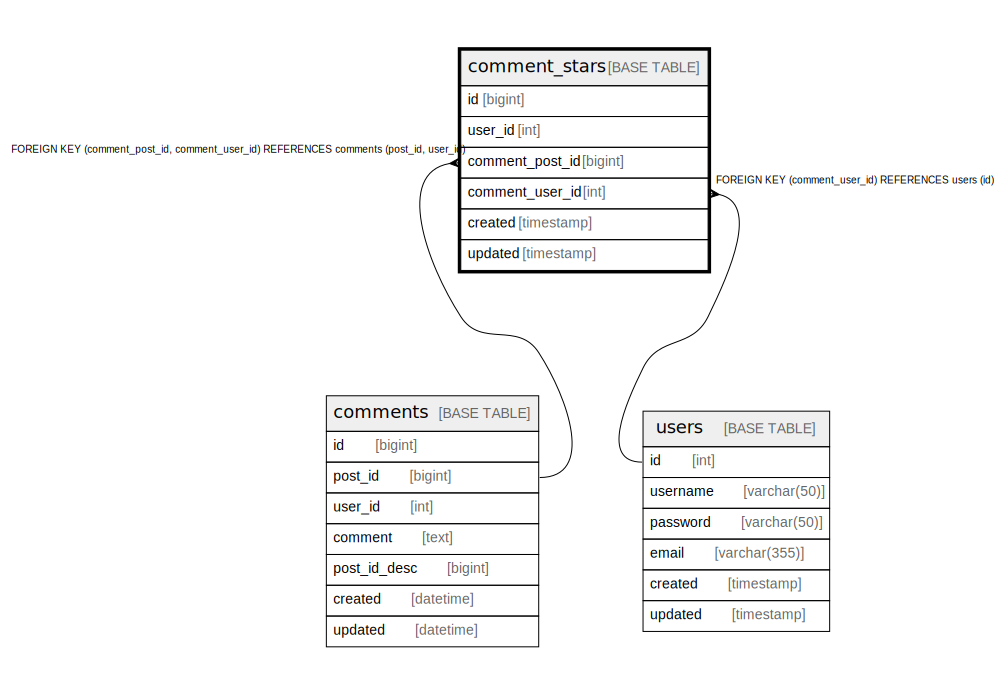

# comment_stars

## Description

<details>
<summary><strong>Table Definition</strong></summary>

```sql
CREATE TABLE `comment_stars` (
  `id` bigint NOT NULL AUTO_INCREMENT,
  `user_id` int NOT NULL,
  `comment_post_id` bigint NOT NULL,
  `comment_user_id` int NOT NULL,
  `created` timestamp NOT NULL,
  `updated` timestamp NULL DEFAULT NULL,
  PRIMARY KEY (`id`),
  UNIQUE KEY `user_id` (`user_id`,`comment_post_id`,`comment_user_id`),
  KEY `comment_stars_user_id_post_id_fk` (`comment_post_id`,`comment_user_id`),
  KEY `comment_stars_user_id_fk` (`comment_user_id`),
  CONSTRAINT `comment_stars_user_id_fk` FOREIGN KEY (`comment_user_id`) REFERENCES `users` (`id`),
  CONSTRAINT `comment_stars_user_id_post_id_fk` FOREIGN KEY (`comment_post_id`, `comment_user_id`) REFERENCES `comments` (`post_id`, `user_id`)
) ENGINE=InnoDB DEFAULT CHARSET=utf8mb4 COLLATE=utf8mb4_0900_ai_ci
```

</details>

## Columns

| # | Name | Type | Default | Nullable | Extra Definition | Parents |
| - | ---- | ---- | ------- | -------- | ---------------- | ------- |
| 1 | id | bigint |  | false | auto_increment |  |
| 2 | user_id | int |  | false |  |  |
| 3 | comment_post_id | bigint |  | false |  | [comments](comments.md) |
| 4 | comment_user_id | int |  | false |  | [users](users.md) [comments](comments.md) |
| 5 | created | timestamp |  | false |  |  |
| 6 | updated | timestamp |  | true |  |  |

## Constraints

| # | Name | Type | Definition |
| - | ---- | ---- | ---------- |
| 1 | comment_stars_user_id_fk | FOREIGN KEY | FOREIGN KEY (comment_user_id) REFERENCES users (id) |
| 2 | comment_stars_user_id_post_id_fk | FOREIGN KEY | FOREIGN KEY (comment_post_id, comment_user_id) REFERENCES comments (post_id, user_id) |
| 3 | PRIMARY | PRIMARY KEY | PRIMARY KEY (id) |
| 4 | user_id | UNIQUE | UNIQUE KEY user_id (user_id, comment_post_id, comment_user_id) |

## Indexes

| # | Name | Definition |
| - | ---- | ---------- |
| 1 | comment_stars_user_id_fk | KEY comment_stars_user_id_fk (comment_user_id) USING BTREE |
| 2 | comment_stars_user_id_post_id_fk | KEY comment_stars_user_id_post_id_fk (comment_post_id, comment_user_id) USING BTREE |
| 3 | PRIMARY | PRIMARY KEY (id) USING BTREE |
| 4 | user_id | UNIQUE KEY user_id (user_id, comment_post_id, comment_user_id) USING BTREE |

## Relations



---

> Generated by [tbls](https://github.com/k1LoW/tbls)
